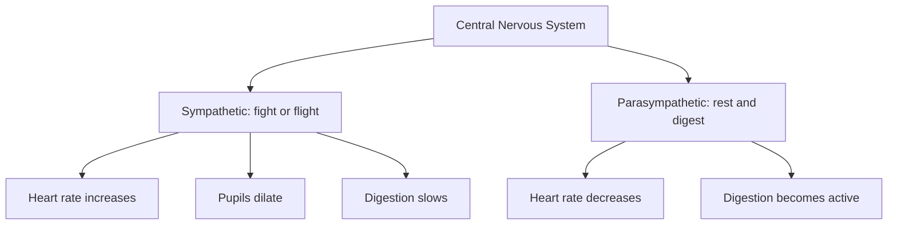
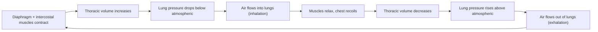
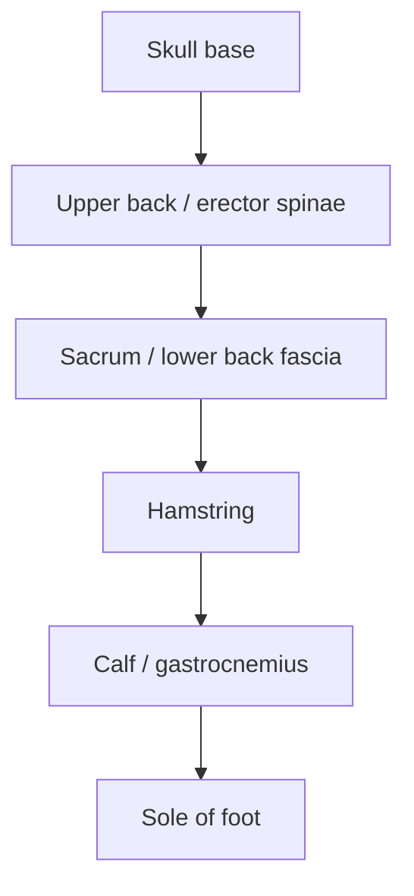
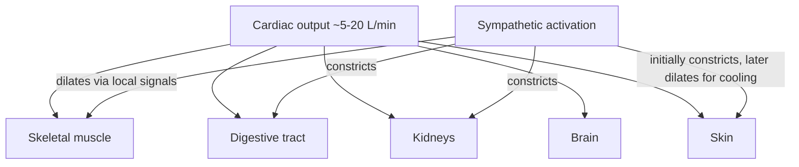
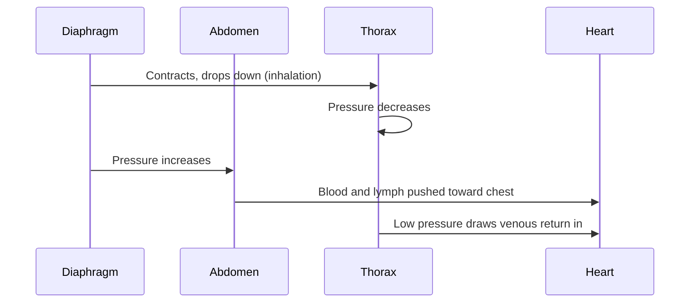
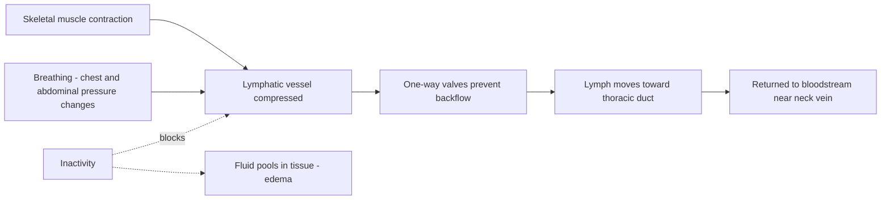
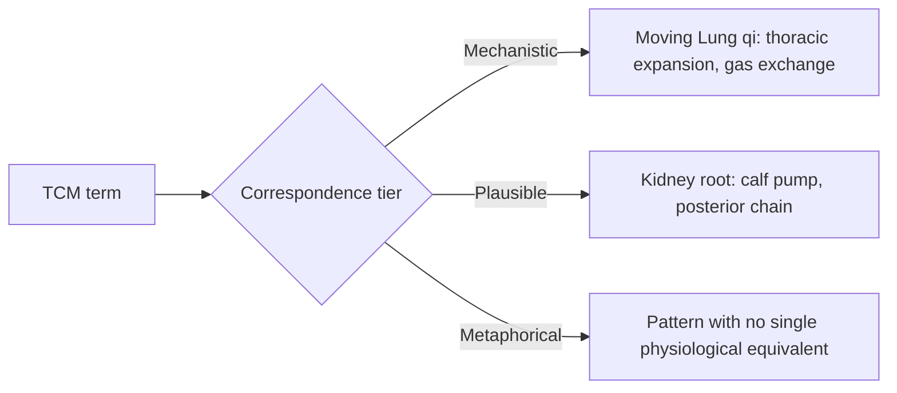

# SPL Run: build_concept_book

- **Adapter:** claude_cli
- **Model:** claude-sonnet-5
- **Tokens:** 39141 in / 17053 out
- **Latency:** 711503ms
- **Timestamp:** 2026-09-27 12:57:02

## Output

```output


---

## The Autonomic Nervous System

The autonomic nervous system is the part of the peripheral nervous system that regulates involuntary body functions — heart rate, blood vessel diameter, digestion, breathing rate, and pupil size — without requiring conscious control. It operates through two complementary branches: the sympathetic division, which mobilizes the body for action, and the parasympathetic division, which conserves energy and supports recovery. Almost every internal organ receives input from both branches, and the balance between them at any moment determines the organ's activity level.

The sympathetic branch is often summarized as the "fight-or-flight" response. When activated — by exercise, stress, or perceived danger — it releases norepinephrine, which increases heart rate and cardiac contraction force, dilates the pupils, redirects blood flow toward skeletal muscles, and slows digestion. This response can raise heart rate from a resting value of roughly 60–80 beats per minute to well over 150 beats per minute within seconds, illustrating how rapidly autonomic signals can override baseline organ activity.

The parasympathetic branch, dominated by the neurotransmitter acetylcholine, produces the opposite pattern, sometimes called "rest-and-digest." It slows the heart rate, stimulates digestive secretions and gut motility, and constricts the pupils. This branch predominates during sleep, relaxation, and after meals.

Worked example: A person resting quietly has a heart rate of 65 beats per minute, reflecting parasympathetic dominance via the vagus nerve. Upon suddenly seeing a car swerve toward them, sympathetic activation raises heart rate to 140 beats per minute within about 10 seconds, redirects blood away from the digestive tract, and dilates the pupils to sharpen vision. Once the danger passes, parasympathetic activity gradually restores heart rate to baseline over one to two minutes — a process athletes and clinicians track as heart rate recovery, since faster recovery is associated with better cardiovascular fitness.

Problem-solving application: Because most organs are dually innervated, clinicians use the balance between the branches diagnostically. For example, heart rate variability — the beat-to-beat variation in timing — reflects how actively the parasympathetic system is moderating sympathetic drive; low variability can indicate chronic stress or autonomic dysfunction. In TCM, practices such as slow breathing and acupuncture are described as calming excess "yang" activity, a traditional framework that maps loosely onto reducing sympathetic dominance, though the underlying physiological mechanisms are best understood in autonomic nervous system terms.


*The central nervous system directs two opposing autonomic branches: sympathetic activation raises heart rate, dilates pupils, and slows digestion, while parasympathetic activation lowers heart rate and promotes digestion.*

---

## Breathing Mechanics

Breathing is driven by pressure differences created by changing the volume of the thoracic cavity, not by the lungs pulling air in on their own. The lungs have no muscle of their own; they expand and recoil passively in response to the chest wall and diaphragm around them.

During inhalation, the diaphragm — a dome-shaped muscle beneath the lungs — contracts and flattens, while the external intercostal muscles lift the rib cage up and outward. Both actions enlarge the thoracic cavity. Because the lungs are sealed against the chest wall by the pleural membranes, they expand along with it. This drop in pressure inside the lungs, relative to the atmosphere, pulls air in through the airway — a direct application of the physical rule that gas flows from higher to lower pressure. At rest, exhalation is largely passive: the diaphragm and intercostal muscles relax, the elastic lungs and rib cage recoil to their smaller resting volume, pressure inside the lungs rises above atmospheric pressure, and air flows back out. Forceful exhalation, such as during exercise or coughing, additionally recruits the internal intercostal and abdominal muscles to actively compress the thoracic cavity.

Consider a worked example: at rest, a typical adult moves about 500 mL of air per breath (tidal volume) at roughly 12–15 breaths per minute, giving a resting minute ventilation of about 6–7.5 L/min. During vigorous exercise, tidal volume can rise toward 2–3 L and breathing rate to 40–50 breaths/min, pushing minute ventilation above 100 L/min. This large increase is achieved mainly by deeper diaphragmatic contraction and greater rib-cage expansion, supplemented by accessory muscles, rather than by breathing faster alone — a useful problem-solving principle when estimating how ventilation must scale to meet a given oxygen demand.


*The breathing cycle: muscle-driven changes in thoracic volume create the pressure gradients that move air in and out of the lungs.*

---

## Skeletal Muscle Contraction

Skeletal muscle contraction is the process by which voluntary muscle fibers shorten to generate force, driven by a signal from a motor nerve and powered by ATP. The trigger is an action potential traveling down a motor neuron to the neuromuscular junction, the synapse between nerve and muscle. There, the neuron releases the neurotransmitter acetylcholine (ACh), which binds receptors on the muscle fiber membrane and causes depolarization — an electrical signal that spreads across the fiber and into its interior via a network of tubules. This signal triggers release of calcium ions from internal storage inside the muscle cell. The calcium ions expose binding sites on actin filaments, allowing myosin heads to attach, pull the actin filament inward (a "cross-bridge" cycle), release, and repeat — sliding the actin and myosin filaments past each other and shortening the muscle. This is called the sliding filament mechanism. Relaxation occurs when nerve stimulation stops, calcium is pumped back into storage, and the binding sites are covered again.

Consider a sprinter pushing off the starting blocks: motor neurons fire rapidly to the quadriceps and calf muscles, triggering thousands of cross-bridge cycles per second across millions of fibers, producing the explosive force needed to accelerate the body. The number of muscle fibers recruited, and the frequency at which each is stimulated, together determine how much force the whole muscle produces — a principle used in resistance training, where lifting near-maximal loads recruits more fibers than light loads.

For problem-solving, muscle force output is often estimated using cross-sectional area, since force capacity scales with the amount of contractile tissue engaged:

$$
F = \sigma \times A
$$

where $F$ is the maximum force a muscle can produce, $A$ is its physiological cross-sectional area, and $\sigma$ is the specific tension of muscle (typically about 20–40 N/cm² for skeletal muscle). A physical therapist estimating strength recovery after injury, or an exercise scientist comparing muscle groups, can use this relationship to predict force output from measured muscle size, such as from an ultrasound or MRI scan.


*The signaling pathway from nerve impulse to muscle contraction.*

---

## Cardiac Output

Cardiac output is the volume of blood the heart pumps in one minute. It depends on two quantities the heart controls directly: how fast it beats (heart rate) and how much blood it ejects with each beat (stroke volume).

$$
\text{Cardiac Output} = \text{Heart Rate} \times \text{Stroke Volume}
$$

Heart rate is measured in beats per minute (bpm), and stroke volume — the volume of blood ejected by the left ventricle in a single contraction — is measured in milliliters. Multiplying beats per minute by milliliters per beat gives milliliters per minute, which is usually converted to liters per minute.

**Worked example.** A resting adult has a heart rate of 70 bpm and a stroke volume of 70 mL. Cardiac output is:

$$
70\ \text{beats/min} \times 70\ \text{mL/beat} = 4900\ \text{mL/min} \approx 5\ \text{L/min}
$$

This matches the commonly cited resting value of about 5 liters per minute — roughly the body's entire blood volume circulated once every minute.

**Problem-solving application.** Cardiac output must rise sharply during exercise to deliver more oxygen to working muscles, and the equation shows the two independent levers the body can pull. Suppose during moderate exercise heart rate rises to 130 bpm while stroke volume increases modestly to 90 mL (a well-trained heart fills more completely and contracts more forcefully). New cardiac output:

$$
130 \times 90 = 11{,}700\ \text{mL/min} \approx 11.7\ \text{L/min}
$$

This is a more than twofold increase. Notice that heart rate contributed the larger share of the change here — that is typical: heart rate can roughly triple or quadruple from rest to maximal exertion, while stroke volume increases more modestly because filling time between beats shortens as heart rate rises. This is also why cardiac output plateaus or even falls at very high heart rates in untrained individuals: if the heart beats too fast, the ventricle does not have time to fill, stroke volume drops, and the gain from higher heart rate is partly canceled out.

The formula also explains clinical reasoning at the bedside. In heart failure, stroke volume falls because the weakened heart cannot contract as forcefully; the body partially compensates by raising heart rate, which is why heart failure patients often have a resting tachycardia. Knowing that cardiac output is a product, not a sum, of two variables lets a clinician or physiology student predict how a change in one factor — blood loss lowering stroke volume, a fever raising heart rate — will shift total blood flow, even without measuring cardiac output directly.

---

## Diaphragmatic Breathing

Diaphragmatic breathing—often called "belly breathing"—is a breathing pattern in which inhalation is driven primarily by contraction of the diaphragm rather than the accessory muscles of the neck and upper chest. As the diaphragm contracts and flattens, it pushes the abdominal contents downward and outward, so the belly visibly rises, while the lower ribs expand sideways. This contrasts with shallow "chest breathing," in which the shoulders and upper ribcage do most of the work and each breath moves a smaller volume of air. Diaphragmatic breathing is typically slow and deep, and it is associated with activation of the parasympathetic nervous system—the branch of the autonomic nervous system that lowers heart rate and promotes recovery, in contrast to the sympathetic "fight or flight" response.

A useful way to quantify a breathing pattern is minute ventilation, the total volume of air moved per minute:

$$
\dot{V}_E = V_T \times f
$$

where $V_T$ is tidal volume (air per breath, in liters) and $f$ is respiratory rate (breaths per minute). A shallow chest breather might take $f = 18$ breaths/min with $V_T = 0.4$ L, giving $\dot{V}_E = 7.2$ L/min. A diaphragmatic breather might slow to $f = 8$ breaths/min but increase $V_T$ to 0.9 L, giving $\dot{V}_E = 7.2$ L/min as well—the same total ventilation, achieved with far fewer, deeper breaths. Because each breath is deeper, more air reaches the lower lung regions where gas exchange is most efficient, and the slower rate itself gives the vagus nerve—the main parasympathetic pathway to the heart—more time to signal a heart-rate slowdown with every exhale.

This distinction matters in practice. A clinician coaching a patient with anxiety-related rapid, shallow breathing does not tell them simply to "breathe less"—that can worsen the sense of air hunger. Instead, the practical target is to slow the rate while holding or increasing tidal volume, for example pacing inhalation and exhalation to a count of four to six seconds each, so minute ventilation stays adequate while breath rate drops. This is also the physiological basis for slow-breathing techniques used in yoga and clinical relaxation training: the mechanism is not "more oxygen" but a shift in autonomic balance produced by slower, deeper diaphragmatic cycles.

---

## Venous Return

Venous return is the volume of blood flowing back into the right atrium per minute. It is not a passive trickle: the veins act as a low-pressure, high-capacity reservoir that must actively deliver blood uphill (from the legs) and against a nearly empty heart during diastole. Three features make this possible: one-way valves inside the veins prevent backflow, contraction of surrounding skeletal muscle squeezes blood forward past those valves (the skeletal-muscle pump), and pressure changes in the chest during breathing draw blood toward the heart (the respiratory pump). Because the heart can only pump out what arrives at its inlet, venous return sets an upper limit on cardiac output over any given time — the two must be equal at steady state.

Physiologist Arthur Guyton formalized this relationship as venous return being driven by the pressure gradient between the systemic veins and the right atrium, divided by the resistance the blood encounters on its way back:

$$
VR = \frac{P_{ms} - P_{ra}}{R_{VR}}
$$

Here $P_{ms}$ is the mean systemic filling pressure (the average pressure in the circulation when the heart is briefly stopped, typically about 7 mmHg), $P_{ra}$ is right atrial pressure, and $R_{VR}$ is the resistance to venous return.

Worked example: suppose mean systemic filling pressure is 7 mmHg, right atrial pressure is 2 mmHg, and venous resistance is 0.05 mmHg per (liter/min). Venous return is then $(7-2)/0.05 = 100$ liters/min in relative units — the key point is that reducing right atrial pressure (as a stronger heart does by emptying more completely) increases the gradient and thus increases venous return, while raising right atrial pressure (as in heart failure) reduces it.

This model explains everyday and clinical scenarios. Standing motionless causes blood to pool in leg veins, lowering venous return and can produce lightheadedness because cardiac output briefly falls. Walking reactivates the skeletal-muscle pump, boosting return. In varicose veins, faulty valves let blood reflux downward, chronically reducing the effective forward flow. A clinician assessing a patient with unexplained fatigue or swollen ankles is often, in effect, asking which term in this pressure-resistance relationship has gone wrong — the reservoir pressure, the resistance in the veins, or the heart's ability to keep right atrial pressure low.

---

## Fascia

Fascia is a continuous sheet of connective tissue, built mostly from collagen and elastin fibers, that wraps every muscle, muscle fiber, organ, nerve, and blood vessel and links them into one mechanically continuous body-wide web. Unlike a tendon (which connects a single muscle to a single bone) or a ligament (which connects bone to bone), fascia forms an unbroken three-dimensional network — pull on it at the heel and the tension can be measured all the way up at the lower back. Anatomists describe fascia in layers: superficial fascia sits just under the skin and stores fat; deep fascia wraps muscles and muscle groups into compartments; and visceral fascia suspends the organs in the chest and abdomen.

Consider a hamstring stretch. The hamstring muscle itself is only part of what resists the stretch. The muscle is sheathed in deep fascia, and that fascia is continuous with the fascia running down the calf to the foot (the "posterior chain"). This is why clinicians observe that a tight, restricted calf can limit hamstring flexibility even when the hamstring muscle itself is not shortened, and why stretching or massaging one region can change tissue tension at a distant site along the same fascial line.

This chain property matters for problem-solving in rehabilitation and sports medicine. When a patient reports pain or stiffness at one joint, a clinician trained in fascial anatomy will examine sites upstream and downstream along the same connective line, not just the painful joint itself, because a restriction anywhere in the chain can transmit strain elsewhere. Foam rolling, myofascial release, and dynamic warm-ups are all designed on this premise: because fascia is continuous and adapts to mechanical load, applying pressure or movement at one point can reduce stiffness measured at a connected point.

Fascia research is still developing — the existence and clinical relevance of specific long-distance "fascial lines" is well established anatomically, but the degree to which manual therapies change fascial tissue itself (rather than just nervous-system sensitivity to stretch) is an active area of study, and claims should be evaluated study by study rather than assumed.

<figure class="cb-figure">
  
  <figcaption>Deep fascia forming a continuous connective-tissue sheath around the thigh muscles. Source: <a href="https://commons.wikimedia.org/wiki/File:2312_Deep_Fascia_of_the_Thigh.jpg">OpenStax Anatomy and Physiology, Deep Fascia of the Thigh</a>, CC BY 4.0.</figcaption>
</figure>

---

## Joint Range of Motion

Every joint in the body has a normal arc through which it can move before bone shape, ligament tension, or muscle length stops it. This arc is called range of motion, and it is measured in degrees using a hinged protractor-like tool called a goniometer, with the joint's neutral anatomical position defined as 0 degrees. Range of motion differs by direction: flexion decreases the angle between two bones (bending the elbow), extension increases it (straightening the elbow), rotation turns a bone around its own long axis (turning the head side to side), and lateral bending tilts a body segment sideways (bending the torso toward one hip). The limiting structures also differ by joint: the knee's flexion is stopped mainly by soft tissue compression, while the elbow's extension is stopped by bone-on-bone contact, which is why the elbow cannot hyperextend as far as the shoulder can move in any direction.

Worked example: a physical therapist measures a patient's shoulder flexion (raising the arm forward and overhead) at 90 degrees, compared with the normal reference range of about 150 to 180 degrees for a healthy shoulder. The deficit, roughly 60 to 90 degrees, tells the therapist how much motion has been lost, whether from a rotator cuff injury, joint capsule stiffness (adhesive capsulitis), or muscle guarding after surgery, and gives a concrete target for rehabilitation.

Problem-solving application: range-of-motion measurements let clinicians track recovery objectively rather than by feel. Suppose a knee that normally flexes to 135 degrees is measured at 80 degrees one week after surgery and 110 degrees four weeks later. The gain of 30 degrees over three weeks (about 10 degrees per week) is a quantitative recovery rate that can be compared against expected healing benchmarks to decide whether therapy is progressing on schedule or needs to be intensified. The same logic applies in strength and flexibility training: a hip that lacks full extension will make a runner overstride and compensate through the lower back, so restoring the missing degrees of hip extension directly reduces the load on nearby joints and lowers injury risk.

---

## Myofascial Lines

Fascia is the sheet of connective tissue that wraps every muscle, and it does not stop cleanly at a muscle's tendon attachments. Instead, the fascia of one muscle blends into the fascia of the next, forming continuous mechanical chains called myofascial lines that run the length of the body. A pull applied at one end of a line transmits tension along the whole chain, so a tight muscle in the calf can restrict motion in the hamstring, low back, or even the scalp, depending on which line connects them. This concept, developed most fully in Thomas Myers's "Anatomy Trains" model, reframes stretching and injury from a single-muscle event into a whole-body one.

Three commonly cited lines illustrate the idea. The superficial back line runs from the sole of the foot up the calf and hamstring, over the back, to the top of the skull; it is loaded whenever you bend forward to touch your toes. The lateral line runs down the side of the body, from the ear past the ribs and hip to the outside of the foot, and stabilizes side-to-side sway during walking. The spiral line wraps diagonally around the trunk, connecting the opposite shoulder and hip, and is active whenever the trunk rotates, as in throwing or golf swings.

Consider a runner with chronically tight calves who develops hamstring and low-back tightness on the same side. A clinician working from the myofascial-lines model would not treat the hamstring in isolation. Because calf, hamstring, and lower-back muscles all lie along the superficial back line, tension anywhere in that chain can present as symptoms elsewhere in it. The practical approach is to test flexibility and release tightness along the entire line, for example using a straight-leg raise to gauge whole-line tension rather than isolated ankle or knee range of motion, and to stretch or foam-roll the calf and back together rather than the hamstring alone.

For problem-solving, this model changes how a trainer plans a stretching routine: instead of assigning one stretch per "tight" muscle, they select a small number of full-line stretches (e.g., a standing forward fold for the superficial back line) that load several muscles in series, then check whether flexibility improves at a joint far from the muscle being stretched — a direct test of whether the chain, not just the local muscle, was the limiting factor.


*The superficial back line: a continuous fascial chain linking the skull, spine, hamstring, calf, and foot, so tension at one end can affect flexibility or pain at the other.*

Evidence for exact line pathways comes mainly from cadaver dissection and clinical observation rather than large controlled trials, so the anatomical continuity is well documented while claims about how strongly tension actually transmits along a full line in living, moving bodies are still being tested.

---

## The Skeletal-Muscle Pump

Blood returning from the legs to the heart faces a genuine mechanical problem: it must travel upward against gravity, through low-pressure veins, with no pump of its own. The skeletal-muscle pump solves this. When a leg muscle — especially the calf — contracts, it thickens and presses against the deep veins running through it, squeezing blood out of that segment. One-way venous valves ensure the squeezed blood is pushed only toward the heart, not back down toward the foot. When the muscle relaxes, the vein refills from below, and the next contraction repeats the cycle. Because this mechanism does so much of the work of returning blood from the lower body, the calf muscle is often called the "second heart."

Consider someone walking briskly. Each step involves a calf contraction, generating local pressures in the deep veins that can transiently exceed 200 mmHg — far higher than the roughly 15 to 20 mmHg found in leg veins during quiet standing. Over a minute of walking, dozens of these contraction-relaxation cycles occur, each one advancing a bolus of blood upward past a valve. This is why walking relieves the heavy, swollen feeling in the legs after long periods of sitting or standing still: without muscle contractions, venous blood pools in the lower legs under gravity, distending the veins and letting fluid leak into surrounding tissue.

The clinical relevance is direct. Prolonged immobility — a long flight, bed rest after surgery, a desk job with no movement — removes the pump's benefit. Blood stagnates in leg veins, raising the risk of a deep vein thrombosis, a clot that can form in a vein that is barely moving. This is why airlines and hospitals recommend ankle flexes, calf raises, or short walks during long periods of inactivity: even small, repeated muscle contractions restore enough venous flow to reduce clot risk. Compression stockings work on the same physical principle from the outside, applying steady external pressure to substitute for muscle squeezing.


*The contraction-relaxation cycle of the calf muscle pump, with valves enforcing one-way flow toward the heart.*

Muscle pump efficiency also explains why athletes cool down with light movement rather than stopping abruptly after intense exercise: without continued calf activity, blood can pool in the legs, reducing venous return and available blood volume for the brain, occasionally causing lightheadedness.

---

## Intra-Abdominal Pressure

Intra-abdominal pressure is the pressure of the fluid and organs inside the abdominal cavity, generated when the diaphragm, the abdominal wall muscles, and the pelvic floor contract together around that cavity. Because the abdomen is largely incompressible — it is mostly fluid and soft tissue — squeezing it from all sides at once turns it into a firm, pressurized cylinder rather than a loose bag. That pressurized cylinder sits directly in front of the lumbar spine and acts like an internal air splint, resisting the forward bending and shear forces that would otherwise fall on the vertebrae and discs. This is why breath control matters during heavy lifting: a full inhale followed by a brief breath-hold (co-contracting the diaphragm downward against a braced abdominal wall) raises intra-abdominal pressure and measurably stiffens the spine before the lift begins.

Consider a person deadlifting a heavy barbell. If they simply hold their breath high in the chest without bracing the abdominal wall, intra-abdominal pressure rises only modestly and the trunk still flexes under load. If instead they take a full breath into the belly, brace the abdominal wall as if bracing for a punch, and hold that pressure through the lift, intra-abdominal pressure can rise several-fold above resting levels, and the spine moves through the lift as a single stiffened unit instead of flexing segment by segment. This bracing strategy — inhale, brace, lift, exhale after the sticking point — is standard coaching practice in strength training and physical therapy for exactly this reason.

Intra-abdominal pressure also changes moment to moment with ordinary movement. During a normal breathing cycle at rest, it rises slightly with each inhale as the diaphragm descends and falls with each exhale. During trunk twisting, such as swinging a golf club or turning to look behind while backing up a car, the oblique muscles co-contract to control rotation, which further raises pressure and helps protect the spine from the shear forces of twisting under load.

For problem-solving purposes, a trainer or clinician uses this concept diagnostically: a client who reports low-back pain specifically during lifting or twisting, but not during ordinary walking, is often failing to generate adequate intra-abdominal pressure at the moment of load, and the practical fix is coaching the brace-and-breathe sequence rather than simply strengthening isolated abdominal muscles.

---

## Sympathetic–Parasympathetic Balance

The autonomic nervous system runs the body's internal operations — heart rate, digestion, airway diameter, pupil size — without conscious control. It has two branches that usually pull in opposite directions. The sympathetic branch prepares the body for exertion or threat ("fight-or-flight"): it raises heart rate and contractility, dilates the airways, shunts blood away from the gut toward skeletal muscle, and releases epinephrine from the adrenal medulla. The parasympathetic branch, dominated by the vagus nerve, does the opposite: it slows heart rate, stimulates digestion and salivation, and promotes recovery ("rest-and-digest"). Almost every organ receives input from both branches, and the observed response reflects the net balance between them at any moment — not a simple on/off switch.

A useful quantitative window into this balance is heart rate. Resting heart rate is set largely by continuous vagal (parasympathetic) restraint on the heart's own pacemaker, which left alone would fire around 100 beats per minute. A resting heart rate of 60–70 beats per minute in a healthy adult reflects strong vagal tone suppressing that intrinsic rate. During a stressful event — a near-miss in traffic, a timed exam — sympathetic activity surges: heart rate can jump to 120–150 beats per minute within seconds, pupils dilate, and blood glucose rises as the liver releases stored glycogen. Minutes after the stressor ends, parasympathetic activity reasserts control and heart rate returns toward baseline; how quickly it does so (heart rate recovery) is itself used clinically as a marker of autonomic health.

Problem-solving application: a runner's heart rate hits 165 beats per minute at the end of a sprint interval and falls to 130 beats per minute one minute later. That 35-beat drop in 60 seconds is a heart rate recovery value; higher values indicate a more rapid parasympathetic reassertion and are associated with better cardiovascular fitness, while blunted recovery (fewer than about 12 beats per minute) is a recognized risk marker for poor autonomic function. Chronic overactivation of the sympathetic branch — from ongoing psychological stress, poor sleep, or overtraining — keeps resting heart rate and blood pressure elevated and impairs digestion, illustrating why sustained sympathetic dominance, rather than its short-term activation, is what causes health problems.

---

## Core Stability

Core stability is the ability to control the position and motion of the trunk over the pelvis during movement, so that force generated in the legs or arms can transfer efficiently without the spine collapsing, twisting, or overextending. The "core" is not just the abdominal muscles seen in a mirror. It is a functional unit made of the diaphragm (top), the pelvic floor muscles (bottom), the deep abdominal wall — especially the transversus abdominis — and the deep spinal muscles (multifidus) wrapping the back. These structures co-contract to raise intra-abdominal pressure, turning the trunk into a semi-rigid cylinder that resists bending and rotation, similar to how pressurizing a can makes it much harder to crush.

**Worked example.** Consider a person performing a deadlift, lifting a barbell from the floor. Before the bar leaves the ground, the diaphragm and pelvic floor contract together against a closed glottis (a brief breath-hold, the Valsalva maneuver), and the transversus abdominis tightens like a corset. This raises intra-abdominal pressure and stiffens the trunk, so the large forces from the hips and legs are transmitted through a stable spine rather than being lost to unwanted flexion at the lumbar vertebrae. If this bracing fails, the lower back rounds under load, concentrating stress on the spinal discs and raising injury risk. Athletes and physical therapists cue this bracing action deliberately, often describing it as "tightening as if about to be punched in the stomach."

**Problem-solving application.** Core stability training is prescribed clinically for people with recurrent low-back pain, since research links poor timing of the deep trunk muscles — particularly a delayed multifidus and transversus abdominis contraction relative to limb movement — to reduced spinal control. A rehabilitation program might start with low-load exercises such as the abdominal draw-in (pulling the navel toward the spine without moving the pelvis) or a bridge hold, progressing to loaded, dynamic tasks like carrying an asymmetric weight in one hand while walking, which forces the trunk muscles to resist unwanted side-bending. The key diagnostic skill is recognizing that core stability is not about how strong or visible the abdominal muscles are, but about the timing and coordination of the diaphragm, pelvic floor, and deep trunk muscles activating just before or during a limb movement to keep the spine in a controlled, neutral position.

---

## The Lymphatic System

The lymphatic system is a one-way network of thin vessels that collects excess fluid from the spaces between cells, filters it through lymph nodes, and returns it to the bloodstream. Unlike the circulatory system, it has no central pump — no equivalent of the heart. Instead, the fluid, called lymph, is moved forward by the squeezing action of nearby skeletal muscles, the rhythmic motion of the digestive tract, and pressure changes from breathing, all working against one-way valves that prevent backflow.

**Worked example.** Blood plasma is pushed out of capillary walls under pressure to bathe tissues in oxygen and nutrients; roughly 20 liters of this fluid leaks out of the capillaries each day, but only about 17 liters are reabsorbed directly back into the capillaries. The remaining 3 liters would accumulate in the tissues, causing swelling, if not for the lymphatic vessels, which pick up this leftover fluid and channel it through lymph nodes — small filtering stations packed with white blood cells — before emptying it back into large veins near the neck. Along the way, lymph nodes trap bacteria, viruses, and abnormal cells, which is why they swell and become tender during an infection: immune cells are multiplying inside them to mount a response.

**Problem-solving application.** Because lymph flow depends entirely on movement rather than a pump, understanding this system explains several everyday and clinical situations. A person confined to bed rest or a long airplane flight may notice swollen ankles, because the calf muscle pump that normally drives lymph and venous return upward is inactive — the practical fix is periodic muscle contraction or elevation of the legs, not medication. After a mastectomy or lymph node removal for cancer treatment, a patient may develop lymphedema, a chronic swelling of the arm, because the local drainage pathways have been surgically interrupted; compression garments and manual lymphatic drainage massage work by manually substituting for the missing muscle pump. Recognizing that lymph movement is passive, rather than pressure-driven the way blood flow is, is the key insight for predicting when and where fluid will accumulate in the body.


*Diagram showing how excess tissue fluid is collected by the lymphatic system, filtered through lymph nodes, and returned to the bloodstream.*

---

## The Posterior Chain

The posterior chain is the group of muscles running along the back of the body — calves (gastrocnemius and soleus), hamstrings, glutes, and the spinal erectors — that act as a single functional line rather than as isolated muscles. When you stand up from a chair, jump, sprint, or simply keep an upright posture against gravity, these muscles fire together in sequence: the calves push off the ground, the glutes and hamstrings extend the hip, and the erectors keep the spine long and stable so force generated at the foot can transfer upward without collapsing at the low back. This is why the posterior chain is often called the body's "engine" for extension movements — it produces most of the power in movements like the deadlift, the jump, and the sprint stride.

Worked example: consider a standing deadlift. As the lifter drives through the heels, the calves stabilize the ankle, the hamstrings and glutes extend the hip, and the erector spinae isometrically hold the spine in a neutral position rather than actively bending it. If the glutes are weak, the erectors and hamstrings are forced to compensate, increasing shear stress on the lumbar spine — a common mechanism behind low-back strain in people with underdeveloped glute strength.

Problem-solving application: a physical therapist evaluating a patient with recurring low-back pain but a structurally normal spine should test hip extension strength, not just the back muscles in isolation, because a weak link anywhere in the chain — commonly the glutes — forces the spinal erectors to overwork as a substitute. Programming exercises such as hip thrusts, Romanian deadlifts, and calf raises addresses the chain as a unit rather than training the lower back alone. The practical takeaway for exercise prescription is that treating the "core" or "back" as a single muscle group is a coordination problem: strengthening one segment (say, the hamstrings) without training the others in sequence rarely resolves compensations that show up during full-body movements like running or lifting from the floor.

---

## Regional Blood-Flow Distribution

Cardiac output does not spread evenly across the body. At rest, a healthy adult's heart pumps roughly 5 liters of blood per minute, and that flow is divided unevenly among organs: about 20% to the kidneys, 20% to the digestive tract, 15% to the brain, 15% to the skeletal muscles, and smaller shares to skin, liver, and heart muscle itself. This division changes constantly, moment to moment, because the autonomic nervous system adjusts the diameter of blood vessels feeding each organ. Sympathetic nerve fibers release norepinephrine onto smooth muscle in vessel walls; in most tissues this narrows the vessel (vasoconstriction), while in exercising skeletal muscle, local chemical signals such as low oxygen and rising carbon dioxide override the sympathetic signal and widen the vessel instead (vasodilation). The result is a redistribution — the same total output, reallocated toward whichever tissues are working hardest.

Worked example: during moderate running, cardiac output can rise from 5 to about 20 liters per minute — a fourfold increase. Skeletal muscle's share of that output rises from about 15% to 70–80%, meaning muscle blood flow can increase more than fifteen-fold. Meanwhile, sympathetic constriction cuts flow to the gut and kidneys to a fraction of resting levels; that is why digestion slows during intense exercise. Skin flow follows a different pattern: it initially drops to help preserve central blood pressure, then rises later in exercise as the body needs to dump heat by radiating warm blood to the skin surface.

Problem-solving application: a clinician evaluating a patient with cold, pale hands during a stressful event is observing sympathetic vasoconstriction diverting blood away from the skin and toward core organs — the physiological basis of the "fight-or-flight" response. Understanding this redistribution matters clinically: it explains why blood pressure readings, skin color, and capillary refill time are used together as bedside indicators of how the body is prioritizing flow under stress, blood loss, or shock.


*Diagram showing how sympathetic nervous activity redirects cardiac output away from digestion and kidney filtration and toward working muscle during exertion.*

---

## The Respiratory Pump

Every breath does more than move air — it also moves blood and lymph. During inhalation, the diaphragm contracts and drops, expanding the chest cavity and dropping pressure inside the thorax while simultaneously raising pressure in the abdomen. This dual pressure shift creates a gradient that pulls venous blood and lymph out of the abdominal veins and lymphatic vessels and toward the chest, assisting their return to the heart. During exhalation, the pattern reverses, and the abdominal compression helps push blood upward along the same path. Because both venous and lymphatic vessels contain one-way valves, this rhythmic pressure cycling produces a net forward flow toward the heart rather than a back-and-forth sloshing.

Worked example: at rest, intrathoracic pressure drops by roughly 4 to 8 mmHg below atmospheric during a normal inhalation. That small drop is enough to measurably increase venous return, which is why central venous pressure — the pressure in the vena cava near the heart — visibly falls during inspiration and rises during expiration on a bedside monitor. Clinically, this respiratory swing in venous pressure is used as a sign of normal cardiovascular-pulmonary coupling; its absence or exaggeration can point to conditions such as cardiac tamponade or severe airway obstruction.

Problem-solving application: consider why deep, slow diaphragmatic breathing is often recommended for reducing leg swelling and improving lymphatic drainage after prolonged sitting, such as on a long flight. Shallow chest breathing barely engages the diaphragm, so the abdominal pressure changes that drive lymph and blood upward are minimal. Deep breathing exaggerates the pressure swing, pulling more fluid out of the abdomen and lower limbs and into the central circulation. This is also why the respiratory pump and the skeletal-muscle pump are usually taught together: leg-muscle contraction supplies the initial push from the periphery, while diaphragmatic breathing supplies the suction that draws blood the rest of the way into the chest.


*The pressure changes of inhalation lower thoracic pressure and raise abdominal pressure, together driving venous and lymphatic flow toward the heart.*

---

## Thoracic Mobility

Thoracic mobility refers to how freely the twelve pairs of ribs, the sternum, and the twelve vertebrae of the mid-back can extend, rotate, and side-bend. Each rib joins the spine at a costovertebral joint and, for the upper ten pairs, attaches to the sternum directly or indirectly through cartilage. When these joints move well, the rib cage can expand in three directions during inhalation: it lifts and widens front-to-back (a "pump-handle" motion at the upper ribs) and side-to-side (a "bucket-handle" motion at the lower ribs). Restriction in any of these joints — from prolonged sitting, rounded posture, or simply disuse — limits how much the chest wall can expand, which in turn limits tidal volume, the amount of air moved in a single normal breath.

A simple worked example: clinicians estimate thoracic expansion by measuring chest circumference at the level of the fourth rib, once after a full exhale and once after a full inhale. A healthy young adult typically shows a difference of 5 to 7 centimeters between the two measurements. A difference under 2.5 centimeters is often flagged as reduced thoracic mobility, commonly seen in conditions such as ankylosing spondylitis or chronic obstructive pulmonary disease, where stiffened joints or hyperinflated lungs blunt the rib cage's ability to move.

For problem-solving practice, consider a patient whose exhale measurement is 88 centimeters and whose inhale measurement is 90.5 centimeters. The expansion is 90.5 minus 88, or 2.5 centimeters — at the low end of normal, suggesting a targeted mobility program (thoracic rotation stretches, foam-roller extension drills, and diaphragmatic breathing) rather than immediate concern. If a follow-up measurement six weeks later shows 91.5 centimeters on inhale with the same 88-centimeter exhale baseline, expansion has grown to 3.5 centimeters, a 40 percent improvement, giving a concrete, trackable outcome for the intervention.

This same principle explains why singers, wind-instrument players, and endurance athletes train thoracic mobility deliberately: a stiffer rib cage forces the diaphragm and neck muscles to work harder to achieve the same air intake, raising the perceived effort of breathing at a given ventilation rate. Restoring rotation and extension in the mid-back is therefore not just a posture fix — it is a direct lever on breathing mechanics and, over time, on measured lung volumes.

---

## Vagal Tone and Heart-Rate Variability

The heart does not beat like a metronome. Even at rest, the interval between beats lengthens slightly on inhalation and shortens on exhalation. This beat-to-beat fluctuation is called heart-rate variability, and its magnitude is used as an indirect index of vagal tone — the level of ongoing activity in the vagus nerve, the main channel of parasympathetic signaling to the heart.

The vagus nerve releases acetylcholine at the heart's pacemaker (the sinoatrial node), which slows the rate of spontaneous firing and lengthens the time between beats. Vagal activity is not constant: it rises and falls with breathing, a pattern called respiratory sinus arrhythmia. During inhalation, vagal output to the heart is briefly suppressed and heart rate rises slightly; during exhalation, vagal output resumes and heart rate falls. A person with high vagal tone shows large, healthy swings in heart rate across each breath; a person with low vagal tone — common with chronic stress, poor cardiovascular fitness, or aging — shows a flatter, more rigid heart rate.

**Worked example.** A wearable device records the time between each heartbeat over one minute of relaxed breathing. Two readings are typical of very different vagal states. Subject A: beat intervals ranging from 800 to 1000 milliseconds within each breath cycle — a swing of 200 milliseconds. Subject B: beat intervals ranging from 850 to 900 milliseconds — a swing of only 50 milliseconds. Subject A has substantially higher heart-rate variability, consistent with stronger vagal tone, even though both subjects might have the same average heart rate of about 68 beats per minute. Average heart rate alone would not reveal this difference; only the variability does.

**Application.** Slow, deep breathing — for example, six breaths per minute instead of the typical twelve to sixteen — lengthens each exhalation phase and gives the vagus nerve more time to act on each cycle, which raises heart-rate variability. This is the physiological basis for why paced breathing, meditation, and some forms of biofeedback training are used to promote relaxation and are studied as adjuncts in managing anxiety and hypertension. Clinically, low heart-rate variability is also an independent marker associated with increased cardiovascular risk, which is why the measure is used in both fitness tracking and cardiac research, not only in relaxation practice.

---

## Interoception

Interoception is the perception of signals arising from inside the body — heartbeat, breathing rhythm, stomach fullness, muscle tension, and the general sense of physiological state. It operates alongside the more familiar exteroceptive senses (vision, hearing, touch) but points inward rather than outward. The signals travel from receptors in the heart, lungs, gut, and muscles through visceral afferent nerves to the brainstem and insula, where they are integrated into a felt sense of "how the body is doing right now." Interoceptive accuracy varies across individuals and can be trained, much like any perceptual skill.

Consider a simple worked example using heart rate. Resting heart rate for a healthy adult typically falls between 60 and 100 beats per minute. A common test of interoceptive accuracy asks a person to count their own heartbeats for 30 seconds without taking a pulse, then compares the counted number to an actual measured count. If someone counts 28 beats while a pulse oximeter records 34, their accuracy score is calculated as:

$$
\text{accuracy} = 1 - \frac{|\text{counted} - \text{actual}|}{\text{actual}} = 1 - \frac{|28 - 34|}{34} \approx 0.82
$$

An accuracy score closer to 1.0 indicates sharper interoceptive awareness; scores well below that suggest the person relies more on external cues (a fitness tracker, a mirror) than internal sensation to know their own state.

This capacity has direct practical applications in mindful movement and eating. In slow, attention-focused movement practice — such as tai chi or yoga — practitioners are asked to notice muscle tension and breath before adjusting posture, rather than moving on autopilot; this feedback loop improves balance and reduces injury from overexertion. In mindful eating, pausing to notice stomach fullness partway through a meal allows a person to stop near satiety rather than past it, which can reduce caloric overconsumption. Because the stretch receptors that signal stomach fullness take roughly 15–20 minutes to fully communicate satiety to the brain, eating slowly gives interoceptive signals time to catch up with intake — a mismatch that fast eating tends to override.

Improving interoceptive awareness is therefore not a vague wellness goal but a trainable skill with measurable stakes: better regulation of eating behavior, more efficient and safer physical movement, and — in clinical contexts — a documented role in conditions such as anxiety and eating disorders, where interoceptive signals are frequently misread or ignored.

---

## Lymph Flow

Blood circulates because the heart provides continuous pressure, but the lymphatic system has no equivalent pump. Lymph — the clear fluid that leaks out of capillaries into surrounding tissue and is collected into lymphatic vessels — moves through the body almost entirely by external forces: contraction of skeletal muscles, changes in pressure from breathing, and one-way valves inside the lymphatic vessels that prevent backflow. Each time a muscle contracts, it squeezes adjacent lymphatic vessels like a hand squeezing a tube of toothpaste, pushing fluid forward; the valves then keep it from sliding back once the muscle relaxes. Deep breathing adds a second pump: pressure changes in the chest and abdomen during inhalation and exhalation draw lymph through the thoracic duct, the largest lymphatic vessel, which empties into a vein near the neck.

This design has a direct practical consequence: without movement, lymph flow slows dramatically, and fluid accumulates in the tissues — a condition called edema. This is why hospital patients on prolonged bed rest often develop swollen ankles, why airline passengers are advised to flex their calves on long flights, and why people with sedentary jobs are told to stand and walk periodically. In each case, the underlying physiology is the same: skeletal muscle contraction is the primary driver of lymph return, so its absence causes fluid to pool wherever gravity or local pressure allows.

The problem-solving takeaway is that interventions for lymphatic pooling target the pump, not the fluid directly. Compression garments substitute external pressure for the missing muscle pump. Manual lymphatic drainage massage manually mimics the rhythmic compression that muscles would normally provide. Elevating a swollen limb above heart level uses gravity to assist the already-weak forward flow. Recommending "drink more water" or "rest the limb" would be physiologically backward — rest is the cause of the pooling, not the cure.


*How muscle contraction and breathing, rather than a central pump, drive lymph forward through one-way valves — and what happens when that mechanism is absent.*

---

## Spinal Rotation and Side-Bending

Rotation and lateral flexion are the trunk's oblique movements. Rotation twists the spine around its long axis — turning the shoulders relative to the hips, as in looking over one shoulder or swinging a golf club. Lateral flexion bends the trunk sideways, tipping one shoulder toward the same-side hip, as in reaching down the outside of the thigh. Both movements are most available in the thoracic spine, where the orientation of the facet joints and the articulation of the ribs with each vertebra allow several degrees of rotation and side-bending per segment — far more than the lumbar spine permits, where facet orientation locks the vertebrae mostly into flexion and extension.

Because the ribs attach to the thoracic vertebrae, rotating or side-bending the thoracic spine also moves the rib cage: the ribs on one side compress while the ribs on the other side spread apart, and the rib angles rotate around the sternum. This is why deep trunk rotation is felt not just as a spinal movement but as a widening and narrowing of the chest wall itself.

Consider a seated trunk-rotation exercise: rotating the shoulders to the right while the hips stay fixed shortens the spinal muscles and connective tissue on the right side of the trunk and lengthens them on the left, while the right-sided ribs draw closer together and the left-sided ribs draw apart. In fascial-anatomy terms, this diagonal loading pattern runs along the spiral line, a continuous band of fascia and muscle that wraps obliquely from one shoulder across the back and ribs to the opposite hip, transmitting force across the trunk during twisting actions like throwing or swinging a bat. Pure side-bending, by contrast, loads the lateral line, a fascial band running down the side of the trunk and leg, which lengthens on the side away from the bend and shortens on the side of the bend.

For problem-solving: a physical therapist assessing a golfer's restricted backswing checks thoracic rotation specifically, since a stiff thoracic spine forces compensatory rotation through the lumbar spine or shoulder, a substitution pattern linked to lower-back strain. Restoring segmental thoracic rotation — through targeted mobility drills rather than lumbar stretching — addresses the actual site of restriction.

---

## Squat Mechanics

A squat is a compound movement: three joints — hip, knee, and ankle — flex together while the trunk stays braced and upright. "Compound" means several joints move at once and several muscle groups contract together, unlike an isolation exercise such as a biceps curl. In a squat, the gluteal muscles and quadriceps extend the hip and knee on the way up, the hamstrings and calf muscles help control the descent, and the trunk (spine, abdominal, and lower-back muscles) stays rigid so force generated by the legs transfers efficiently through the body instead of being lost to spinal bending.

Because the squat recruits the largest muscle groups in the body simultaneously, it demands a disproportionately large share of the body's oxygen and glucose delivery compared to a small-muscle exercise like a wrist curl. The heart responds by increasing heart rate and stroke volume, which raises cardiac output — the volume of blood the heart pumps per minute, calculated as heart rate multiplied by stroke volume, roughly 5 liters per minute at rest and up to 20 liters per minute during heavy leg exercise. At the same time, the rhythmic contraction and relaxation of the thigh and calf muscles physically squeezes the veins running through them, pushing blood back toward the heart. This mechanism, called the skeletal-muscle pump, boosts venous return — the rate blood flows back into the heart — independent of the heart's own action.

Worked example: a 70 kg person performs a set of 12 bodyweight squats. Each descent-and-rise cycle briefly compresses and releases the veins in the thigh, so over 12 repetitions the leg muscles act like a repeated pumping cycle, moving pooled venous blood upward. Combined with the heart rate rising from a resting 70 beats per minute to roughly 130 beats per minute, total blood flow to working muscle rises several-fold within the set.

Problem-solving application: a physical therapist wants to select a leg exercise that maximizes venous return for a patient with mild swelling in the lower legs, without raising heart rate excessively. Because the muscle pump effect depends on repeated muscle contraction and relaxation rather than on high force output, the therapist can prescribe slow, controlled, partial-range squats with more repetitions rather than a few maximal-effort ones — achieving the pumping benefit while keeping cardiac demand moderate.

---

## Tension–Relaxation Cycling

Tension–relaxation cycling refers to a rhythmic pattern of contracting a muscle briefly and then fully releasing it, repeated over multiple cycles, rather than holding the muscle in a single sustained contraction. The contraction phase squeezes the veins and lymphatic vessels running through and around the muscle, pushing fluid forward through one-way valves; the relaxation phase lets those vessels refill with fresh blood and lymph from the tissue bed. Alternating the two phases turns skeletal muscle into an auxiliary pump for both the venous and lymphatic systems, which is why it moves fluid more effectively than isometric holding, where sustained pressure compresses the vessels continuously and can actually restrict flow, especially if the contraction is strong enough to exceed local blood pressure.

Consider a calf-raise exercise: rising onto the toes tenses the calf muscles, compressing the deep veins and driving blood upward toward the heart; the valves in those veins prevent backflow when the muscle relaxes and the vein refills. Repeating this 15–20 times moves noticeably more blood per minute than standing still with the calf muscles held tight, because each relaxation phase restores the pressure gradient that lets the vein refill before the next compression. The same principle explains why standing motionless for long periods causes ankle swelling — no cycling means no pumping — while walking, which naturally alternates calf contraction and release with every step, prevents it.

This principle has direct clinical and practical application. The lymphatic system, unlike the circulatory system, has no central pump of its own and depends almost entirely on surrounding muscle contraction and relaxation to move lymph; this is why post-surgical patients are encouraged to perform gentle, repeated muscle-pumping movements rather than staying still, and why long-haul flight advice includes periodic calf raises and ankle circles rather than static leg tensing. Rehabilitation and physical therapy protocols exploit the same mechanism: prescribing short contract–relax repetitions to reduce limb swelling (edema) after injury is more effective than instructing a patient to simply tighten and hold the muscle, since sustained tension alone cannot restore the pressure gradient needed for continued fluid return.

---

## Tidal Volume and Gas Exchange

Tidal volume is the amount of air that moves into or out of the lungs in a single, normal breath — roughly 500 milliliters in a resting adult. Multiplying tidal volume by breathing rate gives minute ventilation, the total air exchanged per minute:

$$
\dot{V}_E = V_T \times f
$$

where $\dot{V}_E$ is minute ventilation (liters per minute), $V_T$ is tidal volume (liters), and $f$ is respiratory rate (breaths per minute). Not all of this air reaches the alveoli for gas exchange — about 150 mL of each breath fills the trachea and bronchi, a region called dead space, where no oxygen or carbon dioxide crosses into the blood. Alveolar ventilation, the portion that actually matters for gas exchange, is $(V_T - \text{dead space}) \times f$.

**Worked example.** At rest, a person breathes 500 mL per breath at 12 breaths per minute: minute ventilation is $500 \times 12 = 6{,}000$ mL/min, or 6 L/min. Alveolar ventilation is $(500 - 150) \times 12 = 4{,}200$ mL/min. During moderate exercise, tidal volume might rise to 1,000 mL and rate to 20 breaths per minute, giving a minute ventilation of 20 L/min — more than three times the resting value. Because dead space stays roughly fixed, alveolar ventilation rises even faster: $(1{,}000 - 150) \times 20 = 17{,}000$ mL/min, over four times the resting figure. This is why deep, slow breaths ventilate the alveoli more efficiently than shallow, rapid ones for the same minute ventilation — a shallow, fast breathing pattern wastes proportionally more air on dead space.

**Problem-solving application.** Suppose two people both have a minute ventilation of 8 L/min. Person A breathes 400 mL at 20 breaths/min; Person B breathes 800 mL at 10 breaths/min. Their alveolar ventilations differ: Person A gets $(400-150)\times20 = 5{,}000$ mL/min, while Person B gets $(800-150)\times10 = 6{,}500$ mL/min. Despite identical minute ventilation, Person B exchanges more usable air with the alveoli. This principle explains clinical strategies such as pursed-lip breathing in patients with chronic obstructive pulmonary disease, which slows respiratory rate and increases tidal volume to improve oxygen delivery and carbon dioxide removal without increasing total effort.

---

## Dual-Lens Translation: TCM and Physiology

Traditional Chinese Medicine (TCM) and modern physiology describe the human body in two different languages, built from different starting assumptions and evidence traditions. Dual-lens translation is the practice of restating a TCM claim in physiological terms — and vice versa — while being explicit about how tight the fit is. Some translations are mechanistic: the two descriptions point at the same measurable process. Some are plausible: there is a reasonable physiological correlate, but the mapping is not one-to-one. Others are metaphorical: the TCM term captures a pattern of experience that has no single physiological equivalent, and should not be forced into one.

Consider "moving Lung qi." In TCM, this describes actions that make breathing feel freer — deep inhalation, stretching the chest, certain qigong postures. The physiological correlate is fairly direct and mechanistic: thoracic expansion increases lung volume, lowering intrathoracic pressure and drawing air in (Boyle's Law in action), while diaphragmatic descent increases tidal volume and improves gas exchange efficiency. Here the two lenses largely agree — TCM names a functional pattern that physiology can measure.

"Kidney root," by contrast, is looser. In TCM, the Kidney is held to be the root of the body's foundational energy, and weakness there is linked to low back and leg weakness, cold extremities, and poor stamina. A plausible physiological correlate involves the calf pump (the muscle contractions that assist venous return from the legs) and the posterior chain (calves, hamstrings, glutes, spinal erectors) that stabilizes posture and gait. Weak posterior-chain strength does correlate with reduced mobility and circulation problems in older adults — but "Kidney" in TCM also covers reproductive and adrenal-like functions with no clean anatomical match, making this correspondence partial, not equivalent.

Problem-solving application: when a patient reports "weak Kidney qi with cold legs," a clinician using dual-lens translation would not treat "Kidney" as a literal organ diagnosis. Instead, they would ask: is there a measurable physiological correlate here — poor venous return, deconditioned calf muscles, or peripheral vasoconstriction — that a strength and circulation assessment can identify and address? This is the practical value of the method: it lets a plausible-tier TCM description generate a testable physiological hypothesis, without claiming the two frameworks are describing identical mechanisms.


*How a TCM term is sorted into mechanistic, plausible, or metaphorical correspondence with physiology.*

---

## Payoff

Dual-Lens Translation is where this book's two vocabularies finally meet on equal terms. Every earlier chapter has quietly practiced a version of this move — pairing a physiological mechanism with a TCM concept and noting the fit — but here the translation becomes the explicit skill: given a statement in one language, produce its counterpart in the other, and be honest about how tight the correspondence actually is. That honesty is the point. Some pairings are mechanistic, meaning the physiology fully accounts for the traditional claim. Others are plausible, meaning the physiology offers a partial or indirect explanation. Still others are metaphorical, meaning the TCM language describes a real experience or pattern without corresponding to any specific mechanism, and should not be dressed up as if it did.

The concepts feeding into this translation supply both sides of the vocabulary. Tidal volume and gas exchange, along with spinal rotation and side-bending, give the mechanistic anatomy behind 'moving Lung qi': deeper diaphragmatic excursion and thoracic rotation increase minute ventilation and oxygen delivery, which is what practitioners are actually producing when they cue that phrase. Squat mechanics and the calf pump's role in venous return ground 'Kidney root' in the posterior chain and lower-limb circulation — a plausible link, since improved venous return and joint stability may correspond to what TCM describes as rooted, stable Kidney energy, without being a proven one-to-one mapping. Interoception is the bridge concept: it is the felt sense that lets a person notice qi movement or blocked flow in the first place, whether that sensation maps to a nerve pathway or to something less localized. Lymph flow, vagal tone and heart-rate variability, and tension–relaxation cycling round out the physiological register, giving mechanistic anchors for TCM ideas about circulation, calm, and the release of stagnation.

This translation skill does not conclude the subject; it equips you to keep working. The next time you encounter a TCM claim — in a clinic, a text, or your own body — try running it through both lenses: what physiological process could produce this effect, and where does the traditional language add meaning that anatomy alone does not capture? That habit of dual reading is the most transferable tool this book offers.
```
