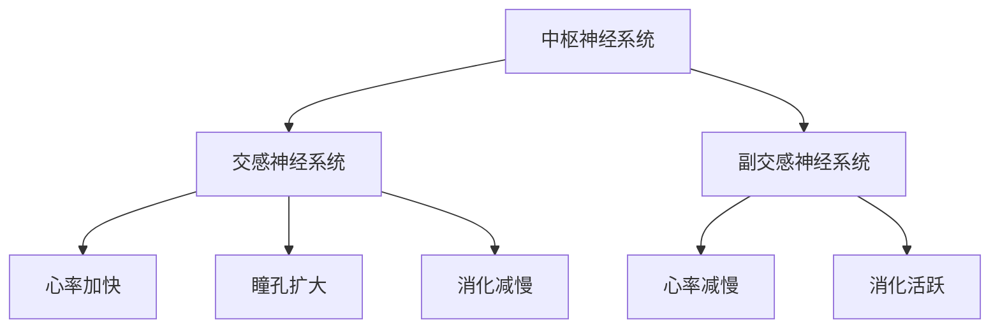
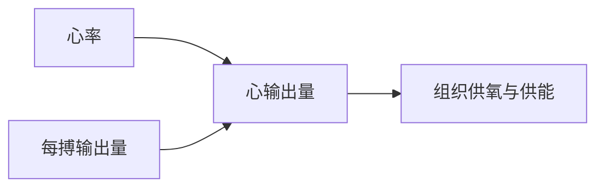
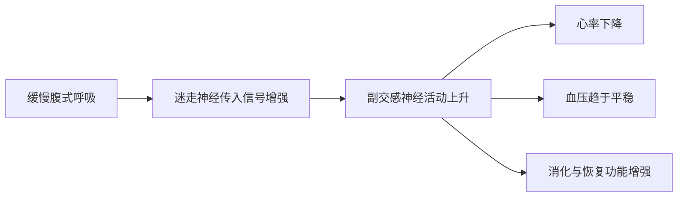
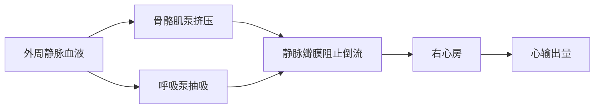
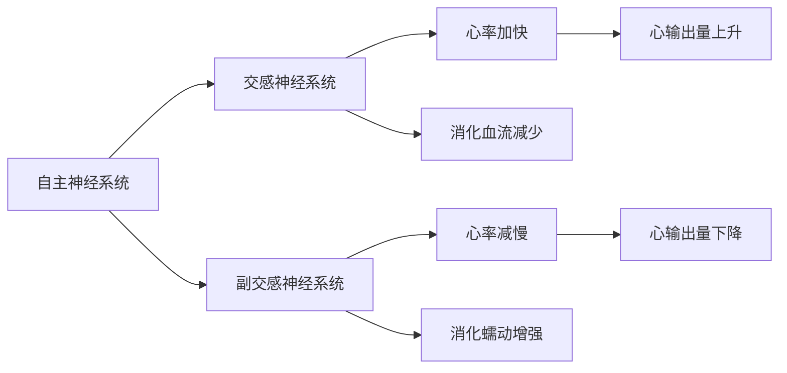
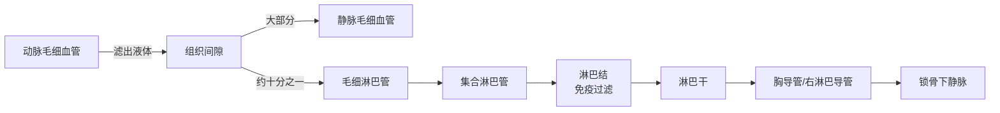
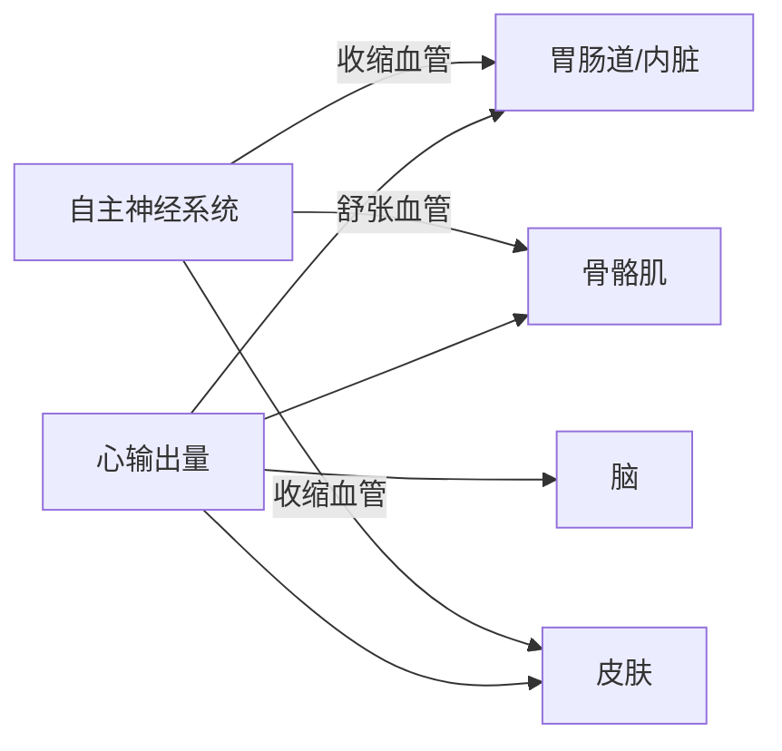
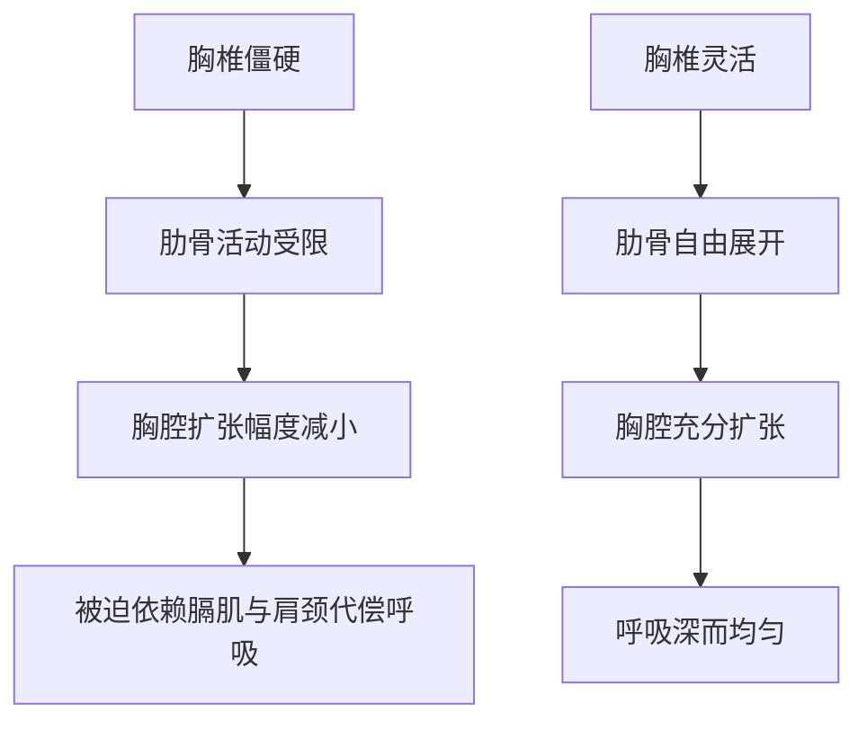
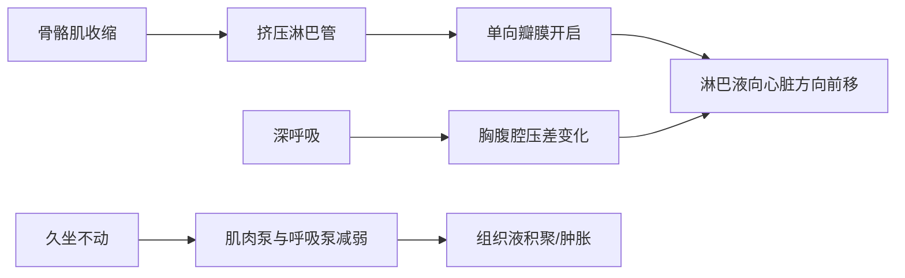
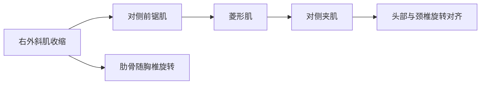

# SPL Run: build_concept_book

- **Adapter:** claude_cli
- **Model:** claude-sonnet-5
- **Tokens:** 39184 in / 5431 out
- **Latency:** 660067ms
- **Timestamp:** 2026-09-27 20:12:56

## Output

```output


---

## 自主神经系统

自主神经系统是负责调控心率、血管张力、消化和呼吸等非自主性生理活动的控制系统。之所以称为"自主"，是因为这些调节过程无需意识参与——人不需要主动思考就能让心脏跳动、瞳孔收缩或胃肠蠕动。自主神经系统分为两个分支：交感神经系统和副交感神经系统，二者通常作用相反，共同维持内环境的稳定。

交感神经系统在应激状态下被激活，常被称为"战斗或逃跑"反应。当遇到威胁或压力时，交感神经会使心率加快、心输出量增加、瞳孔扩大以增强视觉、支气管扩张以增加供氧，同时抑制消化功能，将血流优先分配给骨骼肌和心脏。这一系列变化的目的是让身体在短时间内做好应对紧急情况的准备。

副交感神经系统则在身体处于安静、放松状态时占主导，常被称为"休息与消化"反应。它的作用与交感神经相反：减慢心率、降低心输出量、收缩瞳孔、促进消化液分泌和胃肠蠕动，从而支持能量储存和身体修复。

举一个具体例子：设想一名学生在考试前突然被叫去回答问题。此时心跳会明显加快，手心可能出汗，这是交感神经系统被激活的表现。而当考试结束、学生放松下来后，心率逐渐恢复正常，胃口也随之恢复，这标志着副交感神经系统重新占据主导。日常生活中，心率的这种波动正是评估自主神经系统平衡状态的常用指标之一，临床上常通过测量静息心率和心率变异性来间接反映交感与副交感神经的相对活性。


*该图展示中枢神经系统如何通过交感与副交感两条分支，分别对心率、瞳孔和消化功能产生相反的调节作用。*

---

## 呼吸力学

呼吸并非肺自身主动收缩产生的动作，而是由胸腔容积的变化被动驱动气体流动的过程。膈肌是位于胸腔底部的穹顶状肌肉，收缩时下移并压平，使胸腔纵向容积增大；肋间外肌收缩则提升肋骨、扩大胸腔的前后径与左右径。胸腔容积增大时，肺内压力下降到低于大气压，空气便顺着压力差流入肺部，这就是吸气。呼气时，膈肌和肋间外肌舒张，胸腔容积因肺组织的弹性回缩而减小，肺内压力升高到高于大气压，空气被排出体外。

这一过程遵循气体的基本物理规律——玻意耳定律，即在温度不变的条件下，一定量气体的压强与体积成反比：

$$
P_1 V_1 = P_2 V_2
$$

例如，平静吸气前肺容积约为 $2.5\ \text{L}$，肺内压等于大气压 $760\ \text{mmHg}$。膈肌收缩使肺容积增大到 $2.7\ \text{L}$，代入玻意耳定律可得此时肺内压：

$$
P_2 = \frac{P_1 V_1}{V_2} = \frac{760 \times 2.5}{2.7} \approx 703\ \text{mmHg}
$$

肺内压比大气压低约 $57\ \text{mmHg}$，正是这一压差驱动空气流入肺部，直到肺内压重新等于大气压、气流停止。

在实际问题中，这一关系可用于理解呼吸功的变化：当气道阻力增大（如哮喘发作使支气管变窄）或肺弹性降低（如肺纤维化使肺组织变硬）时，要产生同样的容积变化，膈肌与肋间肌必须收缩得更用力，才能造成足够的压差。这解释了为什么这类患者会出现呼吸困难和呼吸频率代偿性增快——他们并非肺容积不足，而是达到该容积所需的肌肉做功大幅增加。理解容积—压力—气流三者的因果链，是分析多数呼吸系统疾病症状的基础。

---

## 骨骼肌收缩

骨骼肌是受意识支配的肌肉,通过运动神经的激活而收缩产生力量,收缩结束后随即舒张。这一过程被称为兴奋-收缩耦联(excitation-contraction coupling):神经信号先转化为电信号,再转化为化学信号,最终转化为机械收缩。

收缩的起点是运动神经元传来的动作电位。动作电位到达神经末梢与肌纤维交界处——神经肌肉接头(neuromuscular junction)——触发神经递质乙酰胆碱(acetylcholine, ACh)的释放。乙酰胆碱与肌细胞膜上的受体结合,使肌细胞膜去极化,这一电信号沿肌纤维内部的管道系统迅速传导,促使肌浆网释放储存的钙离子($\text{Ca}^{2+}$)。钙离子的出现是关键的触发信号:它与肌丝上的调节蛋白结合,暴露出肌动蛋白(actin)上原本被遮蔽的结合位点,使肌球蛋白(myosin)头部得以与肌动蛋白结合,形成横桥(cross-bridge)。肌球蛋白头部随后发生构象变化,拉动肌动蛋白丝向肌节中央滑动,肌节因而缩短——这就是滑动丝学说(sliding filament theory)所描述的机制:肌丝本身长度不变,是肌丝之间的相对滑动导致肌肉整体缩短。收缩产生的力量大小,取决于同时被激活的运动单位数量,以及每个运动单位的放电频率——这一原理在训练科学中称为动员(recruitment)。

**应用实例**:举重运动员完成一次深蹲,股四头肌需要产生足以支撑数倍体重的力量。神经系统通过增加运动单位募集数量与提高放电频率来提升输出力量,这也是力量训练能提高最大力量输出的神经层面机制之一,区别于肌纤维本身增粗带来的适应。理解这一通路,也能解释为何神经损伤(如运动神经元病)或神经肌肉接头病变(如重症肌无力)会导致肌无力,即使肌纤维本身结构完好。


*图示骨骼肌收缩的兴奋-收缩耦联全过程,从神经信号到机械收缩。*

---

## 心输出量

心输出量指心脏每分钟泵出的血液总量,是衡量心血管系统供血能力的核心指标。其定义由两个变量的乘积构成:心率——心脏每分钟跳动的次数;每搏输出量——心脏每次收缩泵出的血液体积。健康成年人静息状态下心输出量约为每分钟5升,恰好接近全身血液总量,意味着静息时血液平均每分钟完整循环一周。

心输出量的定义式为:

$$
Q = HR \times SV
$$

其中 $Q$ 为心输出量(单位:升/分钟),$HR$ 为心率(单位:次/分钟),$SV$ 为每搏输出量(单位:毫升/次)。

**计算示例**:一名静息成年人心率为每分钟70次,每搏输出量为70毫升。代入公式:

$$
Q = 70 \times 70\ \text{mL} = 4900\ \text{mL/min} \approx 4.9\ \text{L/min}
$$

这一结果与临床常见的5升/分钟静息值高度吻合。

**问题解决应用**:心输出量的公式说明了两条提升供血的独立路径——提高心率或增大每搏输出量,运动时人体两者兼用。假设某人中等强度运动时心率升至每分钟140次,每搏输出量因静脉回流增加而升至100毫升,则:

$$
Q = 140 \times 100\ \text{mL} = 14000\ \text{mL/min} = 14\ \text{L/min}
$$

心输出量较静息时增加约1.86倍,这解释了运动时肌肉获得更多氧气与营养的生理机制。反过来,该公式也是诊断工具:若心率正常但心输出量偏低,提示每搏输出量下降,可能与心肌收缩力减弱或血容量不足有关——这正是临床评估心力衰竭时常用的推理路径。



*心输出量由心率与每搏输出量共同决定,并直接影响全身组织的氧气与营养供应。*

---

## 腹式呼吸

腹式呼吸（也称"膈式呼吸"）是一种以膈肌为主要动力的慢速呼吸方式：吸气时膈肌主动下降，推挤腹腔内容物，使下肋骨向外扩张、腹部隆起；呼气时膈肌放松回升，腹部自然回落。与之相对的是"胸式呼吸"——主要依靠肋间肌抬升胸廓，吸气时肩部和上胸部明显起伏，膈肌参与较少。健康成人在安静状态下的呼吸频率约为每分钟12到18次，腹式呼吸通常将频率降到每分钟6到10次，同时增大每次呼吸的潮气量。

腹式呼吸与自主神经系统的活动状态相关。自主神经系统包含交感神经和副交感神经两个分支：交感神经在应激时被激活，表现为心率加快、血压上升、呼吸变浅变快；副交感神经则在放松状态下占主导，表现为心率减慢、血压下降、消化功能增强。缓慢的腹式呼吸，尤其是延长呼气时间，会通过迷走神经（副交感神经的主要传出通路）向心脏和血管发出信号，从而降低心率、稳定血压。这一机制在临床和运动医学中被广泛用于减轻焦虑、辅助入睡和促进运动后恢复。

**练习方法**：仰卧或坐直，一手放胸口、一手放腹部。用鼻缓慢吸气4秒，感受腹部的手上抬、胸口的手基本不动；然后缩唇缓慢呼气6到8秒，腹部随之凹陷。每组练习5到10分钟，每天可重复2到3次。

**问题解决应用**：假设某人静息心率为78次/分钟，在进行10分钟腹式呼吸练习后测得心率为64次/分钟。这一变化提示副交感神经活动增强、交感神经张力下降，是身体从"应激—唤醒"状态转向"放松—恢复"状态的直接证据。在康复训练、考前减压或术后呼吸训练中，腹式呼吸常被作为无成本、无副作用的第一线干预手段；但对于伴有严重呼吸系统疾病（如慢性阻塞性肺病急性加重期)的患者，应在医生指导下调整呼吸训练强度，而非自行判断。



*该图展示缓慢腹式呼吸如何通过迷走神经激活副交感神经系统，进而影响心率、血压和身体恢复功能。*

---

## 静脉回流

静脉回流是指血液经由静脉系统流回心脏（右心房）的过程。与动脉不同，静脉内压力很低，血流主要依靠三种机制驱动：骨骼肌收缩时对邻近静脉的挤压（骨骼肌泵）、呼吸时胸腔与腹腔压力变化形成的抽吸作用（呼吸泵），以及静脉内的单向瓣膜，防止血液因重力而倒流。这三者共同决定了单位时间内回到心脏的血量。

静脉回流量与心脏泵出的血量（心输出量）密切相关。心脏本身不能凭空产生血液，它只能泵出流入右心房的血液；因此在稳定状态下，心输出量必须等于静脉回流量。生理学中用一个简化关系描述驱动静脉回流的压力差：

$$
Q_v = \frac{P_{ms} - P_{ra}}{R_v}
$$

其中 $Q_v$ 为静脉回流量，$P_{ms}$ 为体循环平均充盈压（血管系统中血液的平均压力），$P_{ra}$ 为右心房压，$R_v$ 为静脉回流的阻力。

**举例说明**：长时间站立不动时，重力使血液淤积在下肢静脉中，骨骼肌泵不工作，静脉回流减少，右心房压 $P_{ra}$ 相对下降，导致心输出量降低，可能引起头晕（体位性低血压）。反之，运动时腿部肌肉有节律地收缩，像泵一样把血液挤向心脏，加上呼吸加深加快，静脉回流显著增加，心输出量随之上升，这正是运动时心脏能泵出更多血液的关键前提之一。

**应用**：医生建议久坐或久站人群穿弹力袜、定时活动小腿，正是通过增强骨骼肌泵作用、减少静脉血液淤积，来维持足够的静脉回流和血压稳定；同样，飞行员在承受高重力加速度时通过绷紧下肢肌肉（M-1动作）来对抗血液向下肢的过度淤积，也是同一原理的实际应用。



*图示：骨骼肌泵与呼吸泵驱动静脉血液经单向瓣膜回流至右心房，最终决定心输出量。*

---

## 筋膜

**定义**　筋膜是包裹并连接全身肌肉、器官和骨骼的连续结缔组织网。它由胶原纤维、弹性纤维和富含糖蛋白的基质构成，分为浅筋膜（皮下脂肪层内）、深筋膜（包裹单个肌肉及肌群）和内脏筋膜（悬吊并固定器官）三层。与肌腱、韧带这类局部结构不同，筋膜是全身贯通的一整片网络：从头皮到足底，理论上找不到一处真正的断点。筋膜内还分布着大量感觉神经末梢和机械感受器，因此它不仅传递机械力，也参与本体感觉——即身体对自身姿势和运动的感知。

**实例分析**　筋膜的连续性可以用一个常见现象说明：许多人做直腿前屈拉伸腘绳肌（大腿后侧肌群）时，会同时在下背部甚至颈部感到牵拉感。这不是错觉，而是因为腘绳肌的深筋膜通过骶结节韧带与竖脊肌筋膜相连，二者共同构成解剖学上所称的"后表链"。研究者用尸体解剖和张力传导实验证实，当一端筋膜被牵拉时，力可以沿链条传递到相距很远的部位，这也解释了为何局部疼痛的根源有时在远隔部位的筋膜紧张。

**问题解决应用**　这一原理直接指导康复和体能训练中的评估思路：物理治疗师在处理慢性下背痛时,不会只检查下背部本身,而会顺着筋膜链向上追溯到足底筋膜、向下检查小腿筋膜的紧张程度,因为任一环节的僵硬都可能通过筋膜牵拉链传导到疼痛部位。常用的干预手段——泡沫轴滚压、筋膜刀刮拭、深层组织按摩——其共同目标是降低局部筋膜基质的粘滞度,恢复相邻组织层之间的滑动性,从而改善整条链的活动范围。理解筋膜的连续性,能帮助学习者跳出"哪里痛医哪里"的思维,转而系统性地评估动力链上游和下游的张力分布,这正是现代运动康复评估的核心逻辑之一。

---

## 关节活动度

关节活动度指一个关节沿其自由度方向能够转动的最大角度范围，通常用度（°）表示。人体主要的运动方向包括屈曲（关节角度减小，如屈肘）、伸展（关节角度增大或恢复到中立位）、旋转（沿骨的长轴转动，如转头）和侧屈（向侧方弯曲，如颈部侧倾）。每个关节能达到的角度范围，受三类结构共同限制：骨与骨之间的形状契合（如肘关节的鹰嘴突顶住肱骨窝，限制过度伸展）、关节囊和韧带的长度与紧张度、以及跨关节肌肉和肌腱的柔韧性与拉伸限度。临床上用量角器（goniometer）测量关节活动度，将其一臂对齐近端骨骼、一臂对齐远端骨骼，直接读出角度。

以肩关节和膝关节为例。健康成年人的肩关节屈曲（手臂向前上举）正常范围约为0°到180°，肩关节外展也接近180°；而膝关节的屈曲范围通常在0°到135°左右，伸展则以0°为正常终点，超过0°的过伸提示韧带松弛或损伤。这些数值是体格检查和物理治疗中评估关节功能的重要参考标准，医生会将患者的实测角度与正常范围比较，判断是否存在功能受限。

在实际问题中，关节活动度的评估常用于康复进度追踪。例如，一名膝关节前交叉韧带术后患者，第2周膝屈曲角度为75°，第6周复查时增至110°，正常膝屈曲上限约135°。计算其恢复百分比：$\frac{110}{135} \times 100\% \approx 81.5\%$，这一简单比值可以帮助治疗师判断康复训练强度是否需要调整，以及是否存在关节僵硬（活动度长期低于正常值）或关节过度松弛（活动度超出正常上限，提示韧带损伤）的风险。关节活动度的丧失还可能来自疼痛引起的保护性肌肉紧张、关节内炎症积液，或长期制动后关节囊粘连，因此临床评估时需要结合病史综合判断限制的具体来源。

---

## 肌筋膜链

**定义**

肌筋膜链（myofascial lines）是指人体内一系列首尾相连的肌肉与筋膜组织，它们沿身体表面或深层形成连续的力学传导路径。这一概念最早由汤姆·迈尔斯（Thomas Myers）在其"解剖列车"（Anatomy Trains）体系中系统化：筋膜（包裹肌肉、连接肌肉与骨骼的结缔组织）并非各自独立，而是像列车车厢一样首尾衔接，将张力从一个身体区域传递到另一个区域。常见的几条链包括：浅背线（从脚底经小腿、大腿后侧、脊柱两侧一直延伸到头顶）、体侧线（从脚外侧沿身体侧面到头侧）、以及螺旋线（斜向缠绕躯干，连接对侧肩胛与骨盆）。需要说明的是，这些链的解剖学连续性在尸体解剖中可以观察到筋膜层面的物理延续，但其在活体中传递张力的具体力学效率仍是运动科学中持续研究的问题。

**举例说明**

一个直观的例子是"够趾"动作：站立并尝试用直腿弯腰去摸脚尖。很多人会感觉到不仅是小腿后侧的比目鱼肌和大腿后侧的腘绳肌在拉伸，连脊柱两侧甚至后颈部都出现紧绷感。这正是因为这些肌肉与筋膜同属浅背线，牵拉链条一端会将张力沿途传导至远端。

**应用于问题解决**

理解肌筋膜链对康复训练与运动表现分析有直接价值。例如，一名反复出现下背部僵硬、但腰椎影像检查正常的患者，问题根源可能并不在腰部本身，而在于浅背线上游的腘绳肌过度紧张，牵拉骨盆后倾，间接增加腰部张力。这时单纯局部按摩腰部效果有限，而针对小腿到大腿后侧的整条链进行拉伸训练，往往能更有效缓解症状。同样，在评估跑步或投掷等旋转性运动损伤时，教练常会沿螺旋线检查对侧髋部与肩部的协调性，而非只看受伤局部。


*浅背线示意：张力沿脚底经小腿、大腿、骨盆、脊柱一直传导至颈枕部，说明局部紧绷可能源于远端牵拉。*

---

## 骨骼肌泵

人体静脉系统在安静状态下容纳全身约六到七成的血容量，但静脉壁薄、压力低，仅靠心脏收缩产生的压力梯度不足以把血液从下肢有效送回心脏，尤其是在人直立、血液必须克服重力上行的时候。骨骼肌泵正是解决这一问题的机制：当腿部肌肉（尤其是小腿的腓肠肌与比目鱼肌）收缩时，肌肉体积膨胀，机械性地挤压其间穿行的深静脉，把静脉内的血液向上"挤"出去；静脉壁上每隔几厘米就有的单向瓣膜此时关闭，阻止血液因重力倒流回下肢，于是血液只能沿着一个方向——朝心脏——移动。肌肉放松时，静脉压力短暂下降，瓣膜关闭防止血液回流，随后血液从远端静脉重新充盈局部静脉网，为下一次收缩做准备。因为小腿肌肉的收缩对静脉回流的贡献如此关键，小腿常被称为"第二心脏"。

举一个具体的例子：一个人长时间站立不动（如站岗、久站工作），小腿肌肉几乎不收缩，骨骼肌泵不工作，血液和组织液在下肢静脉和毛细血管床中淤积，常见表现是脚踝浮肿、静脉曲张风险增加，严重时甚至因回心血量骤减、脑供血不足而晕厥。而如果同一个人原地做几次提踵（脚跟抬起再放下）或走动几步，小腿肌肉的节律性收缩立刻恢复了泵血作用，静脉回流量增加，心脏的前负荷随之提升，每搏输出量按照弗兰克-斯塔林机制相应增大，头晕的感觉往往迅速缓解。

在运动生理学中，骨骼肌泵与呼吸泵（膈肌下降带来的胸腔负压效应）共同作用，是运动时静脉回流量成倍增加、从而支持心输出量大幅上升的重要机制,这也是为什么久坐后突然起身、或长途飞行久坐不动容易诱发下肢静脉血栓的原因——医生建议长途飞行时定时活动小腿，正是利用骨骼肌泵原理预防血液淤滞。


*骨骼肌泵的收缩-舒张循环：肌肉收缩挤压静脉、瓣膜定向导流，推动血液持续向心脏回流。*

---

## 腹内压

腹内压是腹腔内的压力，由膈肌、腹壁肌群（腹横肌、腹内斜肌、腹外斜肌、腹直肌）与盆底肌共同收缩产生。这几组肌肉围成一个近似圆柱形的密闭腔室，膈肌构成顶部、盆底肌构成底部、腹壁肌群构成周壁。当这些肌肉同时收缩时，腔室内的压力升高，从而对脊柱起到支撑作用——类似于给一个可变形的容器加压后，容器壁会变得更硬挺。腹内压在安静呼吸时较低，在深吸气、咳嗽、用力憋气或负重时会显著升高，因此腹内压并非一个固定值，而是随呼吸节律和身体姿态动态变化的量。

**实测举例**：腹内压通常用膀胱内压来间接测量，单位为毫米汞柱（mmHg）。健康成年人平卧安静状态下的腹内压约为 5–7 mmHg；深蹲负重或用力排便时可短暂升高到 40 mmHg 以上；临床上将持续超过 12 mmHg 定义为腹腔内高压，超过 20 mmHg 并伴随器官功能障碍则称为腹腔间隔室综合征，是需要紧急处理的情况。

**应用于解决问题**：在力量训练中，教练常指导学员在深蹲或硬拉前先吸一口气、收紧腹壁，形成一个稳定的"腹内压气囊"，再开始发力。这样做的道理是：脊柱本身抗剪切和抗弯曲的能力有限，若单靠背部肌肉支撑重物，椎间盘承受的压力会更集中；而腹内压升高后，脊柱前方多了一层均匀分布的压力支撑，相当于给脊柱加了一圈"内部护具"，降低了单一脊柱节段的负荷。这也是为什么举重运动员在发力瞬间常出现短暂憋气（称为瓦式动作）——通过声门关闭、胸腹腔同时加压，最大化腹内压对脊柱的保护效果。但长时间瓦式动作会使血压骤升，因此该技巧应仅用于短暂的爆发用力阶段，而非持续负重时的呼吸方式。

---

## 交感与副交感神经平衡

自主神经系统包含两条分支：交感神经系统主导"战或逃"反应,副交感神经系统主导"休息与消化"状态。两者并非非此即彼的开关,而是持续相互拮抗、动态调节心率、血压、消化和呼吸等无意识生理过程的一对系统。交感神经激活时,肾上腺素与去甲肾上腺素释放增加,心率加快、支气管扩张、消化道血流减少,身体准备应对威胁或高强度运动;副交感神经(主要经由迷走神经)激活时,心率减慢、唾液与胃酸分泌增加、消化道蠕动加强,身体转入修复与能量储存状态。健康状态下,两者应能根据情境灵活切换,而不是长期固定在某一端。

心血管系统中,交感与副交感的净效应可以通过心输出量体现,其定义为:

$$
CO = HR \times SV
$$

其中 $CO$ 为心输出量(mL/min)，$HR$ 为心率(次/分)，$SV$ 为每搏输出量(mL)。静息状态下,一名成年人心率约为70次/分,每搏输出量约70 mL,心输出量约为 $70 \times 70 = 4900$ mL/min,即约4.9 L/min。当交感神经被强烈激活(例如剧烈运动或急性应激)时,心率可升至150次/分,每搏输出量因心肌收缩力增强升至约100 mL,心输出量随之升至 $150 \times 100 = 15000$ mL/min,即15 L/min——约为静息值的3倍。

这一机制也是可训练、可测量的:心率变异性(HRV,指连续心跳间期的波动程度)常被用作评估两套系统相对活跃度的指标。HRV较高通常反映副交感张力较强、系统切换灵活;HRV持续偏低则提示交感神经长期占主导,与慢性压力相关。缓慢腹式呼吸(如每分钟6次)能够通过呼吸性窦性心律不齐机制,主动提升迷走神经张力、增强HRV,是一种有实证支持的自我调节练习方法。


*该图展示交感与副交感神经系统对心率、消化和心输出量的相反调节作用。*

---

## 核心稳定

核心稳定指的是在身体运动或受到外力干扰时，通过腹横肌、多裂肌、盆底肌、膈肌等深层肌群的协调收缩，把躯干（脊柱与骨盆）控制在一个安全、有效的姿态范围内。这与"腹肌力量"不完全相同：核心稳定强调的是这些肌肉在动作发生*之前*或*同时*的预先激活能力，而不仅仅是它们能产生多大的力量。其中一个关键机制是腹内压——当膈肌下压、腹横肌与盆底肌同时收缩时，腹腔内部形成一个近似封闭的压力腔，如同给脊柱套上一个"充气腰带"，减少椎间盘承受的压缩负荷。

**举例说明**：搬起地面上的重物时，未经训练者往往先弯腰发力，脊柱几乎单独承受剪切力；受过核心训练者则会先吸气、轻微收紧腹壁（预激活腹横肌），再屈髋屈膝发力，让腹内压先"撑住"脊柱，随后再由下肢和臀部完成大部分做功。研究中常用的"平板支撑维持时间"或"侧桥测试"，衡量的正是深层肌群维持中立脊柱姿态的耐力，而不是最大力量。

**应用与问题解决**：评估核心稳定性时，教练常用的一个简单临床工具是"腹横肌激活测试"——让受试者仰卧屈膝，在做搬腿或搬手臂动作前观察腹壁是否先出现轻微内收（提示腹横肌预激活）。如果动作时腰椎明显前凸增大或骨盆左右摇晃，说明核心控制不足，此时训练重点应放在低负荷、高神经控制的练习（如死虫式、鸟狗式），而非直接增加负重的仰卧起坐。对于下背痛患者，物理治疗中常见的处方是先恢复腹横肌与多裂肌的预激活时序，再逐步过渡到功能性负重动作——这体现了核心稳定训练"先控制、后负荷"的基本原则，也是运动康复中降低复发性腰痛风险的核心策略之一。

---

## 淋巴系统

淋巴系统是一套低压力的管道网络,负责把渗漏到组织间隙的多余液体送回血液循环,同时运输免疫细胞。它没有像心脏那样的中央泵,液体的推动主要依靠骨骼肌收缩挤压淋巴管、周围动脉的搏动、以及淋巴管壁自身的节律性收缩;淋巴管内还有单向瓣膜,防止液体倒流。

**工作原理**:动脉端的毛细血管压力较高,会把血浆中的水分、小分子和少量蛋白质挤压到组织间隙,形成组织液。健康成体每天从毛细血管滤出的液体中,约有十分之一(相当于2至3升)不会直接被静脉端重新吸收,而是被更细小、通透性更高的毛细淋巴管收集。这些淋巴管逐级汇合成集合淋巴管、淋巴干,最终经胸导管或右淋巴导管在锁骨下静脉处重新汇入血液,完成"体液回收"。沿途分布的淋巴结则是免疫监视的关卡:淋巴液流经淋巴结时,其中携带的细菌、病毒碎片或异常细胞会被巨噬细胞和淋巴细胞识别并清除,同时激活适应性免疫反应。

**应用实例——判断水肿的原因**:如果一位患者一侧手臂在乳腺癌手术后出现持续肿胀,而另一侧正常,医生首先会怀疑淋巴回流受阻(常见于手术切除或放疗损伤了腋窝淋巴结),而不是单纯的静脉问题。区分依据在于:静脉性水肿抬高患肢后通常明显减轻,且常伴皮肤发红发热;而淋巴性水肿抬高后改善缓慢,组织质地随时间推移会变得坚实、按压后凹陷恢复很慢,因为淤积的是富含蛋白质的液体,长期滞留会刺激纤维组织增生。这种鉴别思路在康复科和肿瘤术后随访中十分常用,治疗上也会相应采用徒手淋巴引流按摩、弹力绷带包扎等以恢复液体回流的方法,而非单纯的抬高患肢或使用利尿剂。


*该图展示组织液如何从毛细血管渗出,一部分经淋巴管网络逐级回收并在淋巴结完成免疫监视,最终重新汇入静脉血液。*

---

## 后侧链

后侧链是指身体背面由小腿三头肌、腘绳肌（大腿后侧肌群）、臀大肌与脊柱竖脊肌依次连接而成的一条功能性肌肉链。这些肌肉并非各自独立工作，而是在下肢伸展、髋关节伸直和脊柱稳定等动作中按顺序协同发力，把地面的反作用力沿着这条链向上传递，最终转化为身体直立、行走、跳跃或搬举物体的动力。可以把它想象成一条接力链条：小腿把力量交给腘绳肌，腘绳肌交给臀肌，臀肌再交给竖脊肌，任何一环松弛或激活不足，都会让下一环甚至下背部承担额外负荷。

以硬拉（deadlift）动作为例：起始时身体前屈、髋关节弯曲，此时腘绳肌和臀大肌处于拉长状态；上拉过程中，臀大肌率先发力伸髋，腘绳肌协同收缩伸膝，竖脊肌则全程保持脊柱中立、防止腰椎过度弯曲，小腿三头肌稳定踝关节、维持身体平衡。如果臀大肌力量不足或激活延迟，身体会本能地用腰部竖脊肌代偿发力，导致腰椎承受远超其设计的负荷，这正是许多下背部损伤的力学根源。

从生物力学角度看，可以用杠杆原理估算腰椎所承受的力矩：

$$\tau = F \times d$$

其中 $\tau$ 为作用在腰椎上的力矩，$F$ 为搬举物体所产生的力，$d$ 为物体重心到腰椎（力矩支点）的水平距离。当臀肌与腘绳肌未能充分分担伸髋力量时，身体重心相对腰椎的有效力臂 $d$ 会增大，力矩 $\tau$ 随之升高，腰椎间盘和椎旁韧带所受压力也相应增加。这解释了为什么搬重物时"背部弓起、髋部不发力"比"屈髋挺胸、臀肌主导"更容易造成腰伤。

针对这一原理的训练应用包括臀桥（glute bridge）、罗马尼亚硬拉（Romanian deadlift）等动作，其目的正是有意识地激活臀大肌与腘绳肌，缩短力矩计算中的有效力臂 $d$，把负荷从脆弱的腰椎转移到更强壮的髋部肌群，从而降低受伤风险、提高发力效率。

---

## 血流的区域分配

心脏每分钟泵出的血液总量称为心输出量,其定义为心率与每搏输出量之乘积:

$$
\text{心输出量} = \text{心率} \times \text{每搏输出量}
$$

静息状态下心输出量约为每分钟5升,但这5升血液并非均匀分配给全身器官。自主神经系统通过收缩或舒张特定血管床的平滑肌,持续调整血流去向:交感神经激活会使血管收缩(减少该区域血流),而局部代谢产物增多或副交感信号则会使血管舒张(增加血流)。血流分配的原则很直接——身体优先把血液送到当下最需要氧气和营养的组织。

**举例说明**:静息时,骨骼肌大约获得心输出量的20%,消化道(胃肠道及肝脏,合称内脏循环)约获得25%,皮肤约5%,脑部约15%,肾脏约20%。开始中等强度跑步后,心输出量可上升到每分钟20升以上;与此同时,支配内脏血管和皮肤血管(在高强度运动初期)的交感神经使这些区域血管收缩,而支配骨骼肌血管的信号则使其舒张。结果是骨骼肌血流占比可升至80%以上,而内脏血流被大幅压缩。这正是为什么饭后立即剧烈运动容易引起腹部不适——消化系统的血液供应被暂时挪用给肌肉。

**问题解决应用**:假设某人静息心输出量为5升/分钟,内脏循环占25%,即每分钟约1.25升血液流经胃肠道。若运动使心输出量升至20升/分钟,而内脏血流占比降至5%,则实际内脏血流为每分钟1升——虽然总心输出量翻了两番,内脏灌注反而下降。这类计算说明:判断某器官血流是否充足,不能只看心输出量的绝对值,还必须结合该器官当时所占的分配比例。这也是运动生理学中评估器官灌注、设计训练强度或理解运动性胃肠道症状的基本方法。


*运动状态下自主神经系统如何通过收缩内脏和皮肤血管、舒张肌肉血管,重新分配心输出量。*

---

## 呼吸泵

呼吸泵指呼吸运动过程中胸腔与腹腔内压力交替变化，从而推动静脉血和淋巴液从腹部流向胸部、返回心脏的机制。它与骨骼肌泵共同构成静脉回流的两大辅助动力,在心脏本身收缩力之外弥补了外周静脉血压过低、单靠心脏难以将血液从下肢和腹部拉回胸腔的问题。

呼吸泵的工作原理建立在胸腔与腹腔压力的相互关系上。吸气时,膈肌收缩下降,胸腔容积增大,胸腔内压力降低,形成相对负压;同时膈肌下降压迫腹腔器官,使腹腔内压力升高。这一"胸腔降压、腹腔升压"的压力差,恰好沿着从腹部大静脉、下腔静脉到胸腔内静脉和右心房的方向,推动血液顺压力梯度向心脏方向流动。呼气时膈肌放松回升,胸腔压力回升、腹腔压力下降,压力差短暂减小,但静脉瓣膜阻止血液倒流,保证净效应仍是血液向心脏方向的流动。淋巴管同样具备类似的单向瓣膜结构,因此胸导管等大淋巴管中的淋巴液也随呼吸节律被间歇性地"抽吸"入静脉系统。

举一个具体的场景：一名静息状态下的成年人,平静呼吸频率约为每分钟12～16次,每次吸气使胸膜腔内压从约-4毫米汞柱降至约-6毫米汞柱。虽然这一压力变化远小于心脏收缩产生的动脉压(约120毫米汞柱收缩压),但它作用于阻力很小的静脉和淋巴系统,足以显著促进血液和淋巴液的回流。深呼吸或腹式呼吸训练时,膈肌下降幅度更大,胸腔负压更明显,呼吸泵效应也随之增强，这也是瑜伽、太极等强调深长呼吸的锻炼方式常被认为有助于改善循环的生理基础之一。

在实际问题中,理解呼吸泵有助于解释一些常见现象：长时间浅呼吸(如久坐、压力状态下)会减弱静脉回流,可能加重下肢水肿或静脉淤血;而腹式深呼吸练习则常被用作促进淋巴引流和减轻水肿的辅助手段。此外,呼吸泵与骨骼肌泵(行走时小腿肌肉收缩挤压深静脉)协同工作,二者共同解释了为何久坐不动的人更容易出现下肢静脉血液淤积,而适度活动加上深呼吸能有效改善这一问题。

---

## 胸椎与胸廓灵活性

胸椎灵活性指胸廓（肋骨）与上背部脊柱在伸展、旋转和侧屈方向上的活动能力。上段脊柱共有12节胸椎，每节都与一对肋骨相连，因此胸椎的活动幅度直接决定了肋骨能够张开、抬升的程度。这一活动能力既影响体态——长期含胸、久坐会使胸椎逐渐固定在屈曲位——也影响呼吸深度，因为吸气时肋骨需要向外、向上运动以扩大胸腔容积。当胸椎僵硬时，膈肌（横膈）被迫承担更多呼吸工作，呼吸变得浅而急促。

**举例说明**：一名长期伏案工作的办公室职员，胸椎习惯性处于屈曲状态。当他尝试深吸气时，能观察到主要靠腹部隆起、肩部上抬来完成呼吸，而肋骨两侧的扩张幅度很小——这正是胸椎灵活性受限的典型表现。相比之下，经常做胸椎旋转和伸展练习的人，深吸气时能明显看到下肋骨向两侧展开，呼吸更从容、更深。

**问题解决应用**：评估胸椎灵活性最直接的方法是"猫式-骆驼式"或"胸椎旋转"测试——观察坐姿或跪姿下脊柱能否连续、平滑地完成从屈曲到伸展的过渡，以及躯干旋转时肩部能转动的角度。若发现旋转角度明显受限或伴随僵硬感，可通过泡沫轴胸椎伸展、四足位胸椎旋转（thread-the-needle）等动作逐步改善。对于呼吸功能训练者或康复对象，改善胸椎灵活性往往是提高呼吸效率、减少颈肩代偿性紧张的前提步骤，应先于单纯的呼吸肌力量训练进行。



*该图展示胸椎灵活性状态如何分别影响肋骨活动、胸腔扩张与呼吸模式。*

---

## 迷走神经张力与心率变异性

心脏并非以固定节拍跳动。即使在安静静坐时，相邻两次心跳之间的时间间隔也会有细微差异——这种逐拍变化被称为心率变异性（HRV）。HRV 的高低是自主神经系统状态的一面镜子：迷走神经（副交感神经的主干）在每次呼气时向窦房结发出减速信号，在吸气时信号减弱，心跳随之加快，这就是所谓的呼吸性窦性心律不齐。迷走神经张力越高，这种逐拍调节越灵敏，HRV 数值通常也越高；交感神经占主导、身体处于应激或炎症状态时，HRV 则趋于降低。因此，HRV 被广泛用作迷走神经张力的间接、非侵入性指标。

临床和研究中最常用的时域指标是相邻心跳间期之差的均方根，记作 RMSSD：

$$
\text{RMSSD} = \sqrt{\frac{1}{N-1}\sum_{i=1}^{N-1}(RR_{i+1}-RR_i)^2}
$$

其中 $RR_i$ 是第 $i$ 次心跳与下一次心跳之间的时间间隔（毫秒）。RMSSD 主要反映高频、由迷走神经主导的快速波动，受呼吸节律影响明显。

举例说明：某成年人静息时连续记录 6 个 RR 间期（毫秒）：820、845、810、860、830、850。计算相邻差值：25、-35、50、-30、20，平方后求平均再开方，可得 RMSSD 约为 33 毫秒。若同一人在缓慢腹式呼吸（约每分钟 6 次）下重新测量，RR 间期波动幅度通常会显著增大，RMSSD 随之升高，提示迷走神经张力被主动调动。

在实际应用中，HRV 常用于评估训练恢复状态、慢性压力水平以及自主神经功能紊乱的风险：连续多日 RMSSD 低于个人基线，往往提示身体尚未从前一天的训练或压力中恢复，是调整训练强度或安排休息日的客观依据，而非单凭主观疲劳感做判断。

---

## 内感受

内感受指个体对自身体内信号的觉察能力,包括心跳的节律、呼吸的深浅、胃部的饱胀程度以及肌肉的紧张状态。这些信号由分布在心脏、肺、消化道和肌肉中的感受器持续采集,经脊髓和脑干传入岛叶皮层等脑区处理,形成"我现在感觉如何"的内在体验。内感受与视觉、听觉这类感知外部世界的"外感受"相对,是身体自我监测系统的核心。

内感受能力并非人人相同,也不是固定不变的——它可以通过训练增强。以正念饮食为例:多数人进食时习惯以固定速度吃完盘中食物,直到食物见底才停止,而不是依据身体发出的饱腹信号。经过内感受训练的人在进食过程中会主动停顿,询问自己"我现在有几分饱",并根据饱胀感的真实变化调整进食速度和分量。同样,在正念运动练习中,练习者被引导去注意呼吸从急促到平稳的转变,或注意某块肌肉从紧绷到放松的过程,而不是单纯完成动作数量。

内感受的应用价值在于,它把原本自动化、无意识的生理反应转变为可被观察和调节的信息来源。举一个具体场景:一名学生在考试前感到心跳加快、手心出汗,如果缺乏内感受训练,他可能只会将这些信号笼统地体验为"紧张"甚至"不舒服",并因此分心;而经过训练的学生能够更精确地识别出"心率上升、呼吸变浅"这一具体生理状态,进而采用有针对性的调节方法,例如延长呼气时间以激活副交感神经、降低心率。这种"觉察—识别—调节"的三步过程,正是内感受训练在慢性疼痛管理、焦虑缓解和运动表现优化等领域被广泛应用的原因。

需要注意的是,内感受训练强调的是放慢节奏、如实观察身体信号,而不是评判信号的好坏或试图立刻消除不适感——觉察本身,往往就是调节的第一步。

---

## 淋巴流动

淋巴系统是一套遍布全身的细小管道网络,负责收集组织间隙中多余的液体、蛋白质和免疫细胞,最终经锁骨下静脉汇入血液循环。与血液循环不同,淋巴系统没有独立的"泵"——没有心脏那样持续收缩的中心器官来驱动淋巴液流动。淋巴液的推进依赖三种外部机制:骨骼肌收缩挤压淋巴管、呼吸时胸腔与腹腔压力变化形成的"呼吸泵",以及淋巴管壁自身的节律性蠕动。淋巴管内每隔几毫米就有一个单向瓣膜,保证液体只能向心脏方向流动,不会倒流。

**具体机制**:静息状态下,人体每小时约有120毫升淋巴液流回血液,全天总量约2至4升。当小腿肌肉收缩时(例如走路时的踩踏动作),肌肉体积膨胀,挤压穿行其中的淋巴管,推动液体通过瓣膜前移;肌肉放松时,瓣膜关闭防止回流。深呼吸时膈肌下移,腹腔压力升高、胸腔压力降低,在胸导管两端形成压差,同样起到"抽吸"作用。因此,静态站立或久坐时,由于肌肉泵和呼吸泵作用减弱,淋巴液和组织液容易在下肢积聚,表现为脚踝或小腿肿胀。

**应用分析**:假设一名乘客乘坐8小时长途航班,全程久坐不动。下肢肌肉泵基本停止工作,淋巴回流速率可能从正常的120毫升/小时降至不足一半,组织间液持续积聚,导致踝部水肿,严重时还会增加深静脉血栓风险。解决办法并不神秘:每隔1小时起身走动5分钟,或做踝泵运动(反复勾脚、绷脚),即可重新激活肌肉泵,恢复淋巴回流。这也解释了为什么医生建议久坐人群、长期卧床患者以及淋巴水肿术后病人,都要通过主动活动或穿戴压力袜来维持淋巴流动。


*淋巴液依靠肌肉收缩和呼吸产生的压力变化向前推进,久坐会削弱这两种驱动力,导致液体在组织中积聚。*

---

## 脊柱旋转与侧屈

脊柱旋转是躯干绕纵轴的扭转动作，侧屈则是躯干在冠状面内向左右弯曲。这两种动作看似独立，实际上都需要胸椎和肋廓的参与：胸椎因关节突关节呈近似冠状面排列，天然适合旋转，贡献了脊柱轴向旋转总活动度中的大部分，而腰椎关节突关节近乎矢状面排列，机械上限制旋转，正常人腰段旋转角度通常只有几度。侧屈则由胸腰段共同分担，总活动度因个体和年龄差异约在二三十度左右。旋转和侧屈都会牵拉并挤压椎间盘的纤维环，同时需要肋骨随胸椎旋转而产生轻微的扭转和滑动，这也是深呼吸时胸廓能否充分打开常与胸椎灵活度相关的原因。

**动作示例**：坐姿做"躯干旋转"练习——双臂交叉抱肩，双脚固定，缓慢向右转动上半身至最大角度后停留，再转向左侧。若腰椎未被固定，动作者往往会不自觉地用腰椎旋转代偿胸椎活动不足，长期如此会增加腰椎间盘和小关节的剪切负荷。因此更安全的练习是先用双膝夹紧一个瑜伽球或固定骨盆，只让旋转发生在胸椎节段。

**问题解决应用**：假设一名高尔夫球手在挥杆时旋转幅度不足，教练需要判断问题出在胸椎还是腰椎。评估方法是让其坐位固定骨盆后测量躯干旋转角度：若坐位旋转角度明显小于站立位，说明是腰椎在站立位承担了额外旋转，属于代偿模式，训练重点应放在增加胸椎灵活性（如"开书式"拉伸）而非强化腰部旋转力量，以避免腰椎慢性劳损。


*躯干向左旋转时，螺旋线（Spiral Line）沿对角线依次募集外斜肌、前锯肌、菱形肌与夹肌，形成跨越躯干的力传导链。*

理解胸腰椎旋转活动度的天然分工，是设计安全有效的核心训练和康复方案的基础。

---

## 深蹲力学

深蹲是一个多关节动作：髋、膝、踝三个关节同时屈曲，身体重心随之下降，躯干保持相对稳定、不前倾塌陷。完成这个动作的主要是下肢的大肌群——股四头肞、臀大肌和腘绳肌。因为这些肌肉体积大、耗氧多,并且肌肉收缩会挤压深层静脉、把血液推回心脏(称为"肌肉泵"效应),所以深蹲时心率和回心血量都会明显上升,而不只是关节在活动。

**举例说明**：用代谢当量(MET)可以估算深蹲带来的能量消耗。深蹲属于中等到较高强度的抗阻运动，MET 值约为 5–8。已知耗氧量与代谢当量的换算关系为：

$$
\dot{V}O_2 = \text{MET} \times 3.5\ \text{mL/kg/min}
$$

一名体重 70 kg 的人以 6 MET 的强度深蹲，其耗氧量为：

$$
\dot{V}O_2 = 6 \times 3.5 = 21\ \text{mL/kg/min}
$$

换算成全身耗氧量为 $21 \times 70 = 1470$ mL/min，这远高于安静状态下约 250 mL/min 的耗氧水平,说明大肌群同时发力时全身代谢需求会显著增加,心脏必须泵出更多血液来满足氧气供应。

**问题解决应用**：如果要估算做一组 3 分钟深蹲训练消耗的热量，可以用能量换算关系——每消耗 1 升氧气约产生 5 千卡热能。上例中 1470 mL/min 相当于每分钟约 7.35 千卡，3 分钟约消耗 22 千卡。这类计算在制定训练强度、比较不同动作的能量消耗，或为康复病人设定安全心率范围时都很实用：知道某个动作对应的大致 MET 值，就能反推心率负荷是否超出目标区间，从而调整深蹲的深度、速度或负重。

这也解释了为什么深蹲常被用作评估下肢功能和心肺耐力的复合动作——它同时检验关节活动度、肌肉力量和心血管系统对运动的反应能力。

---

## 松紧交替

骨骼肌收缩时,肌肉内部的压力会升高,压迫穿行于肌纤维之间的毛细血管和静脉,使局部血流暂时受阻;放松时压力解除,血液才重新流入组织。生理学研究表明,当一次静态收缩(等长收缩)的力量超过最大随意收缩力的约15%-20%并持续维持时,肌肉内压力会长时间超过灌注压,导致血流被持续遮断,组织趋向缺氧,代谢废物也无法被及时带走。相反,若采取"松紧交替"——短暂收缩数秒后完全放松——每一次放松都会重新打开血流通道,让含氧血流入、把代谢产物随静脉血和淋巴液带走。这种收缩-放松的节律被称为骨骼肌泵,是四肢静脉血和淋巴液回流心脏的重要辅助机制:四肢静脉压力本身很低,单靠心脏搏动难以克服重力把血液从脚踝送回胸腔,必须依靠周围肌肉的挤压帮忙。

想象久坐之后的小腿。若持续绷紧小腿肌肉(比如踮起脚尖静止不动)超过一两分钟,小腿会逐渐发胀、发麻——这正是静态收缩造成血流阻断的直接感受。但若换成有节奏的一紧一松(踮脚尖、放下,踮脚尖、放下,每次约1-2秒),小腿肌肉就像一个可反复伸缩的泵:每次收缩把静脉血向上挤出一段,每次放松又让新鲜血液回填毛细血管床。这也是长途飞行中建议乘客定时活动脚踝、而不是僵坐不动的生理学依据。

若要为久坐人群设计一套促进下肢与盆腔循环的微运动方案,核心原则很简单:避免任何超过20%最大力量的静态维持姿势,转而设计成"收紧2秒、完全放松2秒"的重复动作——放松阶段必须是真正的完全放松,而非仅降低到一半力量,否则毛细血管仍处于半压迫状态,泵血效率会大打折扣。在TCM(中医)的推拿与导引术中,类似的间歇性按压-放松手法(如揉法、拿法)被认为能够"行气活血",这一说法与骨骼肌泵的现代生理学机制相吻合。

---

## 潮气量与气体交换

潮气量指平静呼吸时每次吸入或呼出的空气量，成年人静息状态下约为500毫升。潮气量本身并不能决定气体交换的效率，因为吸入的空气中有一部分停留在鼻腔、气管和支气管等不参与气体交换的"死腔"中，这部分体积约为150毫升。真正到达肺泡、参与氧气与二氧化碳交换的气量，称为肺泡通气量。

呼吸系统每分钟移动的总气量称为每分通气量，其计算方式是潮气量乘以呼吸频率：

$$\dot{V}_E = V_T \times f$$

其中 $\dot{V}_E$ 为每分通气量（升/分钟），$V_T$ 为潮气量，$f$ 为每分钟呼吸次数。而真正有效的肺泡通气量需要先扣除死腔气量：

$$\dot{V}_A = (V_T - V_D) \times f$$

其中 $V_D$ 为死腔容积（约150毫升）。

**实例演算**：静息时，潮气量500毫升、呼吸频率12次/分钟，每分通气量为 $500 \times 12 = 6{,}000$ 毫升，即6升/分钟；肺泡通气量为 $(500-150)\times 12 = 4{,}200$ 毫升，即4.2升/分钟。

**问题解决应用**：假设某人改为浅而快的呼吸方式——潮气量降至300毫升、频率升至20次/分钟，每分通气量仍为 $300 \times 20 = 6{,}000$ 毫升，与前者相同。但其肺泡通气量为 $(300-150)\times 20 = 3{,}000$ 毫升，即3升/分钟，比深慢呼吸时少了近三成。这说明即使每分通气量相同，浅快呼吸也会因为死腔占比升高而降低实际气体交换效率。这正是运动员训练呼吸技巧、麻醉与重症监护中设置呼吸机参数时，宁可增加潮气量也要避免单纯提高呼吸频率的原因：深而慢的呼吸对氧合与二氧化碳排出更有效。

---

## 双重视角：中医与生理学的互译

双重视角互译，是指把中医对身体功能的描述转换成现代生理学的语言，或反过来把生理学的机制"翻译"回中医术语，同时明确标注这种对应关系的可信程度——它是有解剖与生理机制支撑的直接对应，是合理但尚未被证实的推测,还是纯粹的功能性隐喻。这三个层级不能混为一谈：把隐喻当作机制，会导致过度诊断或滥用；把机制误判为隐喻，则会忽视有效的身体信号。

**举例说明。** 中医讲"宣发肺气"，指肺气向上向外布散、推动呼吸。这句话与现代生理学中胸廓扩张、膈肌下降形成负压、空气经支气管进入肺泡完成气体交换的过程高度吻合——两者描述的是同一组解剖结构与生理动作，属于**机制层面**的直接对应。再看"腰腿为肾之根"：中医认为下肢强健关系到肾气充足；从生理学看，小腿肌肉（比目鱼肌、腓肠肌）的收缩构成"肌肉泵"，帮助静脉血液对抗重力回流心脏，而臀肌、腘绳肌、竖脊肌等后链肌群维持躯干姿势与脊柱稳定。下肢无力确实会伴随全身耐力与循环效率下降，但"肾气"并不等同于静脉回流效率，这里属于**合理但未证实**的对应——功能表现相关，机制链条尚未完全打通。而"肾藏志""肾主恐惧"，把情志、意志归为肾的功能，在解剖上并无单一器官或通路与之对应,属于**纯隐喻**层级，是中医用五脏系统组织身心功能的一种分类方式，不宜按字面理解为肾脏生理。

**应用练习。** 遇到任何一句中医功能描述，可依次自问三个问题：这句话是否指向某个具体的解剖结构或可测量的生理过程（机制）？是否有间接的功能相关性、但因果通路未明（推测）？还是它描述的是一类身心功能而非单一器官（隐喻）？例如"脾主运化"——脾在中医中统摄消化吸收与营养输布，可与现代消化系统（胃肠蠕动、胰腺分泌、肠道吸收）建立部分对应，但"脾"本身并非解剖学脾脏，需要按上述框架逐条厘清，才能既尊重传统术语的整体性思路，又不误导读者对身体机制的判断。

---

## Payoff

到目前为止，本书建立了两条并行的语言：一条描述可测量的生理信号——潮气量、迷走神经张力与心率变异性、淋巴流动、脊柱旋转与侧屈、深蹲力学；另一条描述中医用以组织身体经验的术语——肺气、肾根、松紧交替。双重视角：中医与生理学的互译，正是把这两条语言接通的最后一步。它不是宣称二者等同，而是提供一套翻译规则：哪些中医表述对应明确的生理机制，哪些只是合理但尚未证实的关联，哪些纯属比喻性的类比。这正是全书的自然终点——前面每一个概念都在积累"素材"，而互译本身教会读者如何判断素材属于哪一类。

以"肺气不降"为例。中医认为，肺气应当向下、向外舒展，肺气郁滞则表现为胸闷、呼吸浅促。翻译成生理学语言，这对应着胸廓扩张受限与潮气量下降——吸气时膈肌下降、肋骨外展不充分，导致每次呼吸交换的气体量减少，进而影响血氧与二氧化碳的清除效率。这一层对应是机制性的：胸廓活动度和潮气量都可以直接测量，二者之间的因果链条也在生理学中有明确记录。深呼吸训练扩大胸廓活动度，同时被中医描述为"宣肺理气"、被生理学描述为"提高潮气量、增强迷走神经张力从而提升心率变异性"——两种语言在此描述的是同一个可观察的改善。

再看"肾为先天之本，肾根在足跟"。中医将下肢稳定性和体力根基归于肾。翻译过来，这对应小腿肌肉泵与后链（腘绳肌、臀肌、竖脊肌）在深蹲和站立姿势中的力学支撑作用——小腿肌肉收缩推动静脉血回流，后链肌群维持脊柱中立位。这一层对应更接近合理推测：功能上确实相关，但"肾"在中医里同时涵盖内分泌、生殖、衰老等多重含义，不能简单等同于某一组肌肉。而"肾主纳气""肾不纳气则气喘"这类表述，则更多是隐喻性的——它描述的是虚弱、气短的整体印象，并没有对应单一、可定位的生理通路。

练习：选择一个你熟悉的中医表述（如"心主血脉""肝主疏泄"），尝试写出它对应的生理指标，并判断你的翻译属于机制性、合理性还是比喻性对应——这正是本书希望你带走的能力：不轻信、也不轻易否定，而是学会追问"这句话在生理学上到底说了什么"。
```
